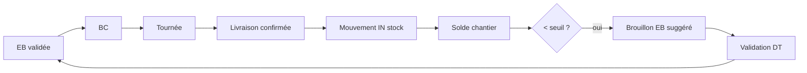

# Règles métier — Stock chantier & commande anticipée

**Version :** 1.2 (décisions DT validées — août 2026)  
**Périmètre :** tenant pilote `co-btp-pilote`  
**Statut :** décisions D2/D4 validées DT — en attente validation board pour mise en prod  
**Documents liés :** [BTP-REGLES-TOURNEES-BC.md](./BTP-REGLES-TOURNEES-BC.md) · [BTP-REGLES-CIRCUIT-ACHATS.md](./BTP-REGLES-CIRCUIT-ACHATS.md) · [BTP-DECISIONS-DT-VALIDEES.md](./BTP-DECISIONS-DT-VALIDEES.md)

---

## 1. Objectif

Une fois les **matériaux livrés et confirmés** sur un chantier (preuve livreur TraceO), permettre :

1. Une **visibilité stock** par site et par produit (unité métier) ;
2. Des **alertes sous-seuil** pour éviter les ruptures ;
3. Une **commande anticipée** via brouillon EB pré-rempli (WhatsApp ou manager), **sans commande automatique silencieuse**.

**Promesse métier :** *« On sait ce qu’il reste sur le chantier et on commande avant la rupture — sans resaisir ce qui est déjà livré. »*

**Prérequis pilote :** flux achats + livraison opérationnel (WhatsApp → EB → BC → tournée → réception).

**Hors scope phase S0–S2 :** valorisation comptable FIFO, multi-dépôts, nomenclature ouvrage, scan code-barres, commande auto sans validation DT.

---

## 2. Principes fondateurs

| # | Principe |
|---|----------|
| P1 | **Le stock naît à la livraison confirmée**, pas à l’émission du BC |
| P2 | **1 BC = 1 chantier** — le stock est **par site** (`sites`), jamais mutualisé entre chantiers sans transfert explicite (hors scope pilote) |
| P3 | **Entrées automatiques** (système) ; **sorties / reliquat** approximatifs (humain) en phase initiale |
| P4 | **Anticipation = suggestion EB**, validation DT obligatoire (aligné circuit achats) |
| P5 | **Commandé non livré** (`en commande`) visible à part — évite double commande |
| P6 | Produit identifié par **libellé normalisé + unité** (ex. `ciment` + `sacs`) — même logique que lignes EB |

---

## 3. Phasage

| Phase | Nom | Contenu | Dépendance |
|-------|-----|---------|------------|
| **S0** | Entrée stock | Mouvement `IN` à livraison confirmée ; solde par site/produit | Livraison BC opérationnelle |
| **S1** | Visibilité + seuils | Tableau chantier, seuils min/cible, alertes manager | S0 |
| **S2** | Commande anticipée | EB suggérée (qté calculée), WhatsApp *stock bas*, UI DT | S1 |
| **S2b** | **Journal quotidien** technicien (matin / soir) | Sorties stock `OUT` depuis consommation déclarée | S1 |
| **S3** | Affinage | Conso régulière, inventaire physique, projection date rupture | Retour terrain S2 |

**Pilote recommandé :** démarrer **S0** en même temps que les premières livraisons BTP ; **S1** sous 2–4 semaines ; **S2** dès que seuils calibrés sur 1 chantier.

---

## 4. Déclencheur entrée stock (phase S0)

| Événement | Action TraceO |
|-----------|---------------|
| Arrêt livraison lié à un BC passe en statut **`delivered`** (ou `partial` avec qté livrée > 0) | Pour chaque ligne produit de l’arrêt / BC : mouvement **`IN`** |
| Livraison **refusée** / **annulée** | **Aucune** entrée stock |
| Livraison **partielle** | Entrée = **quantité livrée déclarée** uniquement |

**Source quantités :** déclaration livreur (quantités acceptées par ligne produit), pas la quantité BC théorique.

**Lien traçabilité :** chaque mouvement `IN` référence `purchase_order_id`, `delivery_point_id`, `receipt_id` si disponible.

---

## 5. Modèle de données cible

### 5.1 Entités

| Entité | Rôle |
|--------|------|
| `site_stock_items` | Référentiel produit **par chantier** : libellé, unité, seuil_min, seuil_cible, actif |
| `site_stock_moves` | Journal : `IN`, `OUT`, `ADJUST` ; qty ; horodatage ; références |
| `site_stock_balances` | Vue / cache : `on_hand`, `on_order` par `(site_id, product_key)` |

`product_key` = normalisation `(label_slug, unit)` — ex. `ciment|sacs`.

### 5.2 Calcul des soldes

```
on_hand     = Σ IN − Σ OUT + Σ ADJUST
on_order    = Σ quantités lignes BC non reçues (statuts po_ready, delivery_scheduled, tournée non livrée)
disponible  = on_hand   (stock physique chantier)
couverture  = on_hand + on_order   (physique + pipeline achats)
```

**Alerte sous-seuil** porte sur **`disponible`** ou **`couverture`** — voir §7.3 (décision à valider).

---

## 6. Sorties et ajustements (phase S1+)

### 6.1 Source prioritaire — journal quotidien technicien (retex DT)

Le DT souhaite que le technicien, **chaque jour** :

| Moment | Contenu | Effet TraceO |
|--------|---------|--------------|
| **Matin** (arrivée chantier) | Tâches à accomplir dans la journée | Entrée journal `plan_jour` — **pas** de mouvement stock |
| **Soir** (fin de journée) | Travail réalisé + **matériel utilisé** (produit, qté) | Mouvements stock **`OUT`** + entrée journal `bilan_jour` |

**Canal pilote (décision D2 — validée DT) :** **WhatsApp uniquement** — pont transfert ou message structuré dans le groupe chantier. Pas de formulaire PWA technicien en phase pilote.

**Exemple message soir (WhatsApp) :**

```
Bilan jour UBH
Réalisé : coulage dalle RDC zone A
Matériel : 12 sacs ciment, 3 barres fer 12mm
```

→ Parse → `OUT` 12 sacs ciment, `OUT` 3 barres fer 12 mm → mise à jour `on_hand` → réévaluation seuils (§7).

**Exemple message matin :**

```
Plan jour UBH
- Finition coffrage zone B
- Réception fer prévue 14h
```

→ Archivé dans dossier chantier ; visible DT ; **aucun** impact stock.

### 6.2 Règles journal quotidien

| # | Règle |
|---|-------|
| J1 | **Soir obligatoire** pour mise à jour stock consommation — pas d’`OUT` auto sans déclaration |
| J2 | Si matériel déclaré **inconnu** au référentiel chantier → proposition création ligne + validation DT |
| J3 | Si `OUT` > `on_hand` → alerte DT « stock négatif — inventaire ? » + `ADJUST` suggéré |
| J4 | DT peut **corriger** le bilan soir avant clôture J+1 08h00 |
| J5 | Matin + soir = **1 entrée journal chacun** minimum attendus en pilote (indicateur adoption) |

### 6.3 Méthodes complémentaires (repli)

Si le technicien n’envoie pas le bilan soir :

| Type | Qui | Quand | Comment |
|------|-----|-------|---------|
| **`OUT`** | DT ou chef chantier | Hebdomadaire | Saisie *« consommation estimée »* |
| **`ADJUST`** | DT | Inventaire ponctuel | Relevé *« il reste X »* |
| **Via WhatsApp** (S2) | Technicien | *« Il reste 15 sacs ciment »* | `ADJUST` — pas une EB |

**Formule « il reste X » :**

```
OUT = on_hand - X   (si X < on_hand, après confirmation DT)
```

**Recommandation pilote :** privilégier le **bilan soir** (§6.1) ; relevé *« il reste X »* en secours le vendredi ou avant inventaire.

---

## 7. Seuils et alertes (phase S1)

### 7.1 Paramètres par produit / chantier

> **Décision D4 (validée DT) :** le **DT** définit et modifie tous les seuils. Le SA consulte en lecture seule.

| Paramètre | Description | Exemple | Responsable |
|-----------|-------------|---------|-------------|
| `seuil_min` | Alerte **urgente** — lancer EB rapidement | 30 sacs ciment | **DT** |
| `seuil_cible` | Stock souhaité après réappro | 80 sacs | **DT** |
| `marge_securite` | % ou quantité fixe ajoutée à la suggestion | +10 % ou +5 sacs |
| `lot_commande_min` | Arrondi fournisseur (lot de commande) | 50 sacs |
| `delai_livraison_jours` | Pour projection rupture (S3) | 2 jours |

### 7.2 Niveaux d’alerte

| Niveau | Condition (défaut proposé) | Action |
|--------|---------------------------|--------|
| **OK** | `couverture ≥ seuil_min` | Aucune |
| **ATTENTION** | `seuil_min > couverture ≥ seuil_min × 0,5` | Badge dashboard DT |
| **CRITIQUE** | `couverture < seuil_min × 0,5` | Dashboard + **WhatsApp DT** (D3/D4) |
| **RUPTURE** | `on_hand = 0` et `on_order = 0` | Alerte prioritaire **dashboard + WhatsApp** + suggestion EB |

### 7.3 Décision à valider — base de l’alerte

- [ ] **A** — Alerte sur **`on_hand`** seul (stock physique) — **plus prudent**, commande plus tôt  
- [ ] **B** — Alerte sur **`couverture`** (physique + en commande) — **recommandé** si délais fournisseur courts  
- [ ] **C** — Les deux : attention sur couverture, critique sur on_hand seul  

**Recommandation :** **B** avec escalade **C** si BC en commande depuis > N jours sans livraison.

---

## 8. Commande anticipée (phase S2)

### 8.1 Formule quantité suggérée

```
besoin = seuil_cible - couverture
si besoin <= 0 → pas de suggestion

qté_brute = besoin + marge_securite
qté_suggérée = arrondi_supérieur(qté_brute, lot_commande_min)
```

Exemple : cible 80, couverture 25 → besoin 55 ; marge +5 ; lot 50 → **suggestion 60 sacs**.

### 8.2 Déclenchement suggestion EB

| Déclencheur | Comportement |
|-------------|--------------|
| Passage alerte **ATTENTION** ou **CRITIQUE** | Créer **brouillon EB** `source=stock_alert` (pas de soumission auto) |
| Message WhatsApp *« stock bas ciment »* / *« commander ciment »* | Parser + enrichir avec `qté_suggérée` si stock connu |
| Bouton UI **« Créer EB depuis alerte »** | DT / SA → brouillon pré-rempli |

**Contenu brouillon :**
- `site_id` = chantier concerné  
- Lignes = produit(s) sous seuil avec `qté_suggérée`  
- `notes` = *« Alerte stock — disponible X, seuil Y, couverture Z »*  
- `needsReview = true` — **DT valide toujours**

### 8.3 Anti double-commande

Avant suggestion :

```
si ∃ EB/BC en cours pour (site, product_key) avec statut ∉ {rejected, delivered}
   → alerter « commande déjà en cours » — pas de nouveau brouillon auto
```

Statuts concernés : `daf_review`, `sa_review`, `po_ready`, `delivery_scheduled`, etc.

### 8.4 Pas de commande automatique

Même en alerte **CRITIQUE** : **aucun** BC ni EB soumis sans action DT (*« Valider et soumettre »*). WhatsApp peut **notifier** le groupe, pas commander seul.

---

## 9. WhatsApp et stock (phase S2)

| Message type | Traitement |
|--------------|------------|
| Besoin classique (*« 50 sacs ciment »*) | Flux EB existant (capture besoin) |
| Relevé stock (*« il reste 20 sacs ciment »*) | `ADJUST` / mise à jour solde — **pas** une EB |
| Demande anticipée (*« on va manquer de ciment »*, *« stock bas fer »*) | Vérifier solde → brouillon EB suggéré ou renvoi vers relevé |
| Question (*« combien de ciment ? »*) | Réponse auto (phase 2) : *« ~40 sacs sur chantier, 50 en commande BC-xxx »* |

**Formation technicien (1 phrase) :** *« Pour commander : décrivez le besoin. Pour le stock : dites “il reste X sacs de …”. »*

---

## 10. Interface manager (cible)

### Onglet **Stock chantier** (DT, SA lecture)

| Zone | Contenu |
|------|---------|
| Tableau | Produit, unité, on_hand, on_order, couverture, seuils, niveau alerte |
| Actions DT | Ajuster seuils ; relevé *« il reste X »* ; créer EB depuis alerte |
| Historique | Mouvements `IN`/`OUT`/`ADJUST` (7 / 30 jours) |
| Lien | BC / livraisons / EB source |

### Badge

- Compteur alertes **ATTENTION + CRITIQUE** sur sidebar manager (comme inbox EB).

---

## 11. Lien avec livraison et BC



Voir [BTP-REGLES-TOURNEES-BC.md](./BTP-REGLES-TOURNEES-BC.md) pour la partie BC → tournée.

---

## 12. Normalisation produits

Les libellés WhatsApp / EB varient (*« ciment »*, *« sacs ciment »*, *« CIM IVOIRE »*).

| Niveau | Règle pilote |
|--------|----------------|
| **Pilote** | Table de mapping manuelle `aliases` → `product_key` par entreprise |
| **Évolution** | Synonymes IA + validation DT à la première entrée stock |

**Même unité obligatoire** pour agréger (sacs ≠ tonnes sans conversion — hors scope pilote).

---

## 13. Rôles et responsabilités

| Rôle | Stock |
|------|-------|
| **Technicien** | Relevé *« il reste X »* (optionnel) ; expression besoin WhatsApp |
| **DT** | **Définit et modifie** les seuils ; validation EB suggérée ; ajustements ; inventaire ; reçoit alertes **WhatsApp + dashboard** |
| **SA** | Lecture stock et seuils — **pas de modification** des seuils |
| **Livreur** | Entrée stock **indirecte** via livraison confirmée |
| **DAF / PDG** | Aucune gestion stock |

---

## 14. Paramètres tenant

| Paramètre | Défaut pilote | Responsable |
|-----------|---------------|-------------|
| `btp.stock_enabled` | `false` → `true` (S0) | Admin |
| `btp.stock_alert_basis` | `couverture` (`on_hand` \| `couverture`) | DT |
| `btp.stock_suggest_eb_on_alert` | `true` (S2) | DT + SA |
| `btp.stock_whatsapp_balance_reply` | `false` → `true` (S2) | DT |
| `btp.stock_duplicate_order_guard_days` | `7` | SA |

**Pilote produits :** liste blanche initiale par chantier (ex. ciment, fer, sable, gravier, tôles) — **3 à 5 références**.

---

## 15. Cas limites

| Situation | Règle |
|-----------|--------|
| Livraison partielle | `IN` = qté livrée ; reliquat BC → `on_order` jusqu’à livraison complète ou clôture |
| Retour fournisseur | `OUT` + note — hors scope auto pilote |
| Transfert chantier A → B | Hors scope pilote ; `OUT` A + `IN` B manuel phase 3 |
| Produit non référencé à la livraison | Créer `site_stock_item` à la volée ou file DT |
| BC annulé après `IN` | **Ne pas** annuler auto le stock — `ADJUST` DT + investigation |
| Inventaire : physique < système | `ADJUST` négatif ; alerte écart > 10 % |

---

## 16. Critères de succès pilote (8 semaines après S1)

| Indicateur | Cible |
|------------|-------|
| Entrées stock auto / livraisons confirmées | **100 %** |
| Ruptures constatées terrain sans alerte préalable | **< 2** sur la période |
| EB issues d’alerte stock validées par DT | **≥ 70 %** des alertes CRITIQUE |
| Double commande même produit < 7 jours | **0** |
| Relevés stock (physique) / semaine / chantier pilote | **≥ 1** |

---

## 17. Matrice de décision rapide

```
Livraison confirmée sur chantier (BC lié)
    │
    └─► Mouvement IN (lignes livrées) → mise à jour on_hand

Évaluation alerte (quotidienne ou à chaque mouvement)
    │
    ├─ couverture ≥ seuil_min → OK
    ├─ seuil_min > couverture ≥ 50% seuil → ATTENTION
    └─ couverture < 50% seuil → CRITIQUE
            │
            ├─ commande déjà en cours ? → notifier seulement
            └─ sinon → brouillon EB suggéré → DT valide
```

---

## 18. Prochaine étape technique (après validation)

1. Tables `site_stock_items`, `site_stock_moves`, vue `site_stock_balances`
2. Hook post-livraison : `delivered` → `IN` (intégration `deliveries` / arrêt BC)
3. Calcul `on_order` depuis `purchase_orders` + statuts demande
4. UI onglet Stock chantier (S1)
5. Moteur alertes + brouillon `source=stock_alert` (S2)
6. Parser WhatsApp extensions *relevé* / *stock bas* (S2)
7. E2E : livraison → solde ; seuil → brouillon ; garde anti-doublon
8. Invariants `e2e/INVARIANTS.md` + entrées dédiées

---

## 19. Validation (signature)

| Rôle | Nom | Date | OK / Réserves |
|------|-----|------|----------------|
| DT | | | |
| SA | | | |
| Chef chantier / technicien référent | | | |
| Exploitant / MOA | | | |

**Produits pilote (liste) :**

```
(ex. ciment/sacs, fer/barres, sable/m³, …)
```

**Seuils initiaux chantier pilote :**

```
(à compléter par le DT)
```

**Réserves / dérogations :**

```
(à compléter)
```

---

*Références : [BTP-REGLES-TOURNEES-BC.md](./BTP-REGLES-TOURNEES-BC.md), `docs/originaux/` (registre BC), flux livraison `DeliveryPage` / quantités livrées.*
