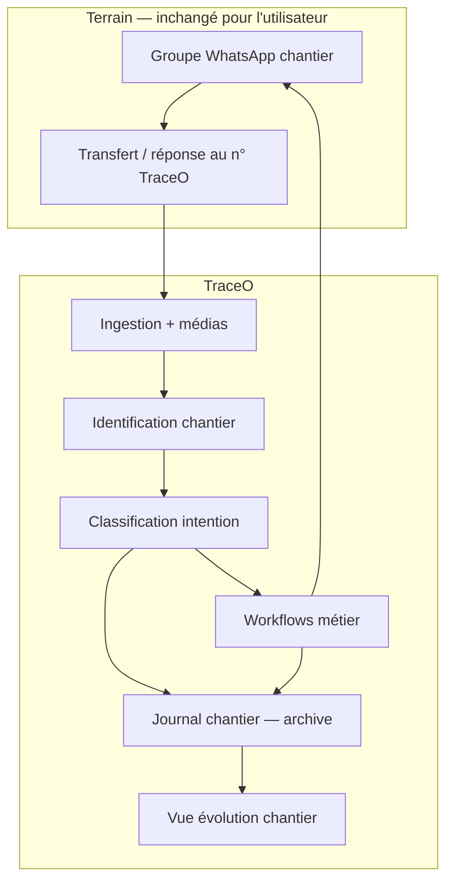

# Règles métier — WhatsApp intrant & dossier chantier

**Version :** 1.0 (brouillon à valider)  
**Périmètre :** tenant pilote `co-btp-pilote` — extension Achats chantier TraceO  
**Validateurs cibles :** DT, chef de chantier, SA, direction exploitation  
**Statut :** en attente de validation board — **pas de mise en prod** tant que ce document n’est pas signé  

**Documents liés :**

- [BTP-PRESENTATION-BOARD.md](./BTP-PRESENTATION-BOARD.md) — vision board  
- [BTP-REGLES-TOURNEES-BC.md](./BTP-REGLES-TOURNEES-BC.md) — BC → tournée  
- [BTP-REGLES-STOCK-CHANTIER.md](./BTP-REGLES-STOCK-CHANTIER.md) — stock & anticipation  

---

## 1. Objectif

**WhatsApp reste l’outil de travail principal sur le terrain.** Il ne doit pas être remplacé, mais devenir :

1. **L’intrant unique** de tous les workflows TraceO (achats, livraison, stock, suivi d’avancement) ;
2. **La source archivée** de tout échange pertinent lié à un chantier ;
3. **Le socle** d’une **vue d’évolution** du chantier pour le DT, la direction et le board.

**Promesse métier :**

> *« Le groupe WhatsApp du chantier continue comme aujourd’hui. TraceO capte, classe, relie et conserve — pour que rien d’utile ne reste noyé dans le fil de discussion. »*

**Ce que le technicien ne change pas :** il écrit, envoie des photos et des vocaux **dans le groupe** (ou au numéro TraceO selon la charte pilote). Pas d’application supplémentaire obligatoire en phase 1.

---

## 2. Principes fondateurs

| # | Principe |
|---|----------|
| P1 | **WhatsApp = bus terrain** — tout message capturé est rattaché à un **chantier** (`site`) |
| P2 | **Un message peut servir plusieurs usages** — journal + brouillon EB + alerte stock |
| P3 | **Classification avant action** — pas tout message ne déclenche un workflow ; tout message **utile** est **archivé** |
| P4 | **Validation humaine** sur les actions à impact (EB, BC, ajustement stock) |
| P5 | **Le groupe reste le lieu de vie** — TraceO **renvoie** statuts et accusés dans le groupe quand c’est possible |
| P6 | **Évolution = faits + jalons** — livraisons, photos datées, EB/BC, stock, jalons DT manuels |
| P7 | **Traçabilité audit** — message original conservé (texte, média, auteur, horodatage) |

---

## 3. Modèle cible : du message au dossier chantier

### 3.1 Chaîne générale



### 3.2 Identification chantier

| Méthode | Règle | Priorité |
|---------|-------|----------|
| **Groupe mappé** | `sites.whatsapp_group_id` = ID groupe Meta | 1 |
| **Transfert depuis groupe connu** | Métadonnée `groupId` sur le message ingéré | 1 |
| **Mention chantier** | Texte `#UBH` ou nom site configuré | 2 |
| **Numéro émetteur** | Téléphone technicien référent → site par défaut | 3 |
| **Ambigu** | Message en **boîte DT** « à classer » — pas perdu | — |

**Règle pilote :** 1 chantier = 1 groupe WhatsApp dédié (recommandé). Multi-chantiers dans un même groupe = hors scope pilote.

### 3.3 Types d’intention (classification)

Chaque message capturé reçoit une ou plusieurs **étiquettes** :

| Intention | Exemples terrain | Workflow déclenché |
|-----------|------------------|-------------------|
| `eb_besoin` | « 50 sacs ciment pour demain » | Brouillon EB → validation DT |
| `stock_bas` | « Il reste 5 sacs » | Alerte stock + EB suggérée (phase S2) |
| `photo_avancement` | Photo ouvrage + « dalle RDC terminée » | Journal + jalon évolution |
| `photo_reception` | Photo livraison / BL | Lien livraison si tournée en cours |
| `plan_jour` | « Plan jour … » — tâches matin | Journal seul — visibilité DT |
| `bilan_jour` | « Bilan jour … » + matériel utilisé | Journal + sorties stock `OUT` |
| `incident` | « Fuite sur dalle », « retard fournisseur » | Journal + notification DT |
| `info_generale` | Coordonnées, consignes, réunion | Journal seul |
| `reponse_statut` | « OK », « reçu » | Accusé lié à une demande en cours |
| `non_classe` | Bruit, emoji seul | Archivé ; pas de workflow |

**Règle :** en cas de doute, **archiver d’abord**, proposer une action au DT ensuite — ne pas ignorer.

---

## 4. Workflows alimentés par WhatsApp

WhatsApp n’est pas limité aux achats. Chaque workflow **consomme** des messages classés et **produit** des événements visibles dans le dossier chantier.

| Workflow | Entrée WhatsApp | Sortie traceable | Lien existant TraceO |
|----------|-----------------|------------------|----------------------|
| **Expression de besoin** | Texte, vocal, photo liste | EB → DAF → SA → BC | `purchase_request_drafts`, `purchase_requests` |
| **Livraison** | Photo réception, « camion arrivé » | Preuve + statut tournée | Tournées / `deliveries` |
| **Stock chantier** | « Stock bas », relevé soir matériel utilisé | `OUT` + alerte + EB suggérée | [BTP-REGLES-STOCK-CHANTIER.md](./BTP-REGLES-STOCK-CHANTIER.md) |
| **Journal quotidien** | Matin : plan jour ; Soir : bilan + consommation | Dossier + stock | [Stock §6](./BTP-REGLES-STOCK-CHANTIER.md) |
| **Avancement travaux** | Photos chantier, % oral | Jalons + galerie datée | **Nouveau** — §6 |
| **Incidents / blocages** | Message problème | Ticket léger + notif DT | **Nouveau** — §6 |
| **Accusés & statuts** | Réponses groupe | Message TraceO « BC-xxx expédié » | Notifications sortantes |

**Invariant :** tout workflow validé crée une entrée dans le **journal chantier** avec lien vers l’objet métier (EB, BC, livraison, jalon).

---

## 5. Journal chantier (archive structurée)

### 5.1 Rôle

Le **journal** est la mémoire du chantier : tout ce qui a été capturé depuis WhatsApp (et les événements système) y est **horodaté**, **filtrable** et **consultable** sans rouvrir 6 mois de messages groupe.

### 5.2 Contenu d’une entrée journal

| Champ | Description |
|-------|-------------|
| `site_id` | Chantier |
| `occurred_at` | Date/heure du fait |
| `source` | `whatsapp` \| `system` \| `manager` |
| `source_message_id` | Lien `whatsapp_messages` si applicable |
| `event_type` | Voir §3.3 + événements système |
| `title` | Résumé court (ex. « EB-2026-0142 validée DT ») |
| `body` | Texte / transcription vocal |
| `media_urls` | Photos, documents |
| `related_entity` | `{ type, id }` — EB, BC, delivery, stock_move, milestone |
| `author` | Nom + téléphone WhatsApp |
| `visibility` | `terrain` \| `bureau` \| `direction` |

### 5.3 Événements système (sans WhatsApp)

Le journal intègre aussi les faits produits par TraceO :

- EB soumise / validée / refusée  
- BC émis  
- Tournée créée / livrée / partielle  
- Entrée stock  
- Jalon DT posé manuellement  

**Résultat :** une **timeline unique** mélangeant terrain et back-office.

### 5.4 Modèle de données cible (à implémenter post-board)

| Entité | Rôle |
|--------|------|
| `whatsapp_messages` | **Existant** — brut ingesté ; ajouter `site_id` recommandé |
| `site_journal_entries` | **Nouveau** — entrée normalisée dossier chantier |
| `site_milestones` | **Nouveau** — jalons d’évolution (manuel + auto) |
| `site_media` | **Nouveau** ou blobs liés — galerie photos par chantier |

Les brouillons EB gardent `source_message_ids` (déjà en place) ; le journal est la **vue unifiée** au-dessus.

---

## 6. Vue évolution du chantier

### 6.1 Objectif direction

Permettre de répondre en un coup d’œil :

- **Où en est le chantier ?** (phase, jalons, retard éventuel)  
- **Qu’est-ce qui s’est passé cette semaine ?** (livraisons, photos, incidents)  
- **Y a-t-il un risque rupture ou blocage ?** (stock, commandes en attente)

### 6.2 Indicateurs d’évolution (pilote)

| Indicateur | Source | Mise à jour |
|------------|--------|-------------|
| **Dernière activité terrain** | Dernier message / photo WhatsApp | Temps réel |
| **Livraisons du mois** | Tournées `delivered` | Auto |
| **EB en cours** | Statuts workflow achats | Auto |
| **Stock critique** | Produits sous seuil | Auto (phase S1+) |
| **Photos récentes** | `photo_avancement` | Auto |
| **Jalons** | DT pose « Dalle RDC coulée » | Manuel + suggéré IA |
| **Incidents ouverts** | Messages `incident` non clos | Semi-auto |

### 6.3 Phases d’évolution (exemple configurable par chantier)

Pour le pilote, le DT définit **3 à 7 jalons** type :

1. Terrassement / fondations  
2. Gros œuvre RDC  
3. Gros œuvre étages  
4. Second œuvre  
5. Finitions  
6. Réception provisoire  

Chaque jalon peut être :

- **Posé manuellement** par le DT (date + commentaire + photos) ;
- **Suggéré** par l’IA à partir de photos / messages (« semble correspondre à coulage dalle ») — **validation DT obligatoire** ;
- **Enrichi** par des faits auto (ex. première livraison fer = début gros œuvre).

### 6.4 Écran manager cible (maquette fonctionnelle)

```
┌─────────────────────────────────────────────────────────────┐
│ Chantier UBH — Résidence Les Lilas          [Actif] 78 %   │
├─────────────────────────────────────────────────────────────┤
│ Jalons:  ●━━●━━●━━○━━○━━○   Gros œuvre RDC (en cours)       │
├──────────────┬──────────────────────────────────────────────┤
│ Cette semaine│ Timeline (filtres: Achats | Photos | Tout) │
│ 3 livraisons │ 08/08 10:12 — Photo avancement (Jean)       │
│ 1 EB validée │ 08/08 09:40 — EB-0142 → BC en cours         │
│ 0 alerte stk │ 07/08 16:00 — Camion livré — preuve OTP     │
│              │ 07/08 08:15 — « 20 barres fer urgent »      │
├──────────────┴──────────────────────────────────────────────┤
│ Galerie récente  [img] [img] [img] [img]                    │
└─────────────────────────────────────────────────────────────┘
```

Le **% d’avancement** en pilote = **jalons validés / jalons totaux** (pas de BIM). Affiner en phase ultérieure si besoin.

---

## 7. Capture WhatsApp — modes et limites Meta

### 7.1 Mode retenu pour le pilote : pont transfert / réponse

| Action terrain | Capture TraceO |
|----------------|----------------|
| Besoin matériaux | Message ou vocal **transféré** au n° TraceO **ou** réponse directe au bot |
| Photo avancement | Transfert photo + légende **ou** envoi au n° TraceO |
| Stock bas | Même pont ; mot-clé optionnel `#stock` |
| Tout message important | **Transfert** = archivage garanti |

**Formation terrain :** 5 minutes — *« Ce qui compte pour le bureau : transférer au numéro TraceO ou taguer #traceo »*.

### 7.2 Lecture passive du groupe entier

L’API WhatsApp Business **ne garantit pas** la lecture automatique de tous les messages d’un groupe. Options futures (hors pilote) :

- Compte **Coexistence** / partenaire BSP avec capacités étendues ;
- Bot **membre du groupe** (selon politique Meta du moment) ;
- Export manuel périodique pour rattrapage.

**Décision board :** valider le **pont** comme mode officiel pilote ; réévaluer lecture groupe à J+90.

### 7.3 Boucle retour groupe

TraceO **publie** dans le groupe (ou en DM au chef de chantier) :

- Accusé réception : *« EB-0142 enregistrée — en attente DT »*  
- Statut BC / livraison  
- Alerte stock (phase S2)  

→ Le groupe reste le **tableau de bord terrain** ; TraceO est le **système de record**.

---

## 8. Phasage implémentation

| Phase | Nom | Contenu | Dépendance |
|-------|-----|---------|------------|
| **W0** | Ingestion + journal brut | Tout message pont → `whatsapp_messages` + `site_journal_entries` | Board + Meta |
| **W1** | Classification | EB / photo / stock / info | W0 |
| **W2** | Workflows achats | Déjà prototypé — brancher sur journal | W1 |
| **W3** | Galerie & jalons | Photos + jalons DT + % évolution | W1 |
| **W4** | Stock + alertes groupe | Lien [stock](./BTP-REGLES-STOCK-CHANTIER.md) | Livraisons OK |
| **W5** | Synthèse direction | Export PDF dossier chantier / mail hebdo | W3 |

**Alignement pilote :** W0–W1 en parallèle de la phase achats 1 du board ; W3 dès le 2ᵉ mois pilote.

---

## 9. Règles de gouvernance & confidentialité

| Sujet | Règle |
|-------|-------|
| **Qui voit quoi** | Technicien : groupe ; DT : journal complet ; direction : synthèse + jalons |
| **Messages personnels** | Hors transfert pont → non capturés (comportement attendu) |
| **Rétention** | Durée alignée politique entreprise (ex. durée chantier + 2 ans) |
| **Suppression** | Droit de rectification via DT ; log d’audit conservé |
| **Médias** | Stockage blob chiffré (déjà prévu `media_blob_key`) |

---

## 10. Critères de succès pilote (dossier chantier)

| Indicateur | Cible 3 mois |
|------------|--------------|
| Messages pont capturés / messages « métier » estimés | ≥ **60 %** |
| EB avec message source lié dans le journal | **100 %** |
| Photos avancement dans galerie chantier | ≥ **2 / semaine** |
| DT consulte vue évolution | ≥ **1 / semaine** |
| Direction : « je vois l’état sans ouvrir WhatsApp » | ≥ **4/5** en enquête interne |

---

## 11. Décisions board attendues

- [ ] Valider WhatsApp comme **intrant officiel** de tous les workflows pilote  
- [ ] Valider **1 groupe = 1 chantier** sur le site pilote  
- [ ] Valider charte **pont transfert** (+ formation 5 min)  
- [ ] Valider liste **jalons évolution** pour le chantier pilote (3–7 étapes)  
- [ ] Désigner **référent DT dossier chantier** (pose jalons, classe messages ambigus)  
- [ ] Valider phasage **W0–W3** dans le planning pilote  

---

## Annexe — Mapping prototype actuel → cible

| Existant aujourd’hui (local) | Gap vers dossier chantier |
|------------------------------|---------------------------|
| `whatsapp_messages` + webhook simulate | Ajouter `site_id` sur message ; médias image/audio |
| `sites.whatsapp_group_id` | OK — mapping groupe → chantier |
| `purchase_request_drafts.source_message_ids` | OK — lien EB ↔ message |
| Pas de `site_journal_entries` | À créer (W0) |
| Pas de vue évolution manager | À créer (W3) |
| Pas de classification multi-intention | À créer (W1) |

---

*Document à valider avec le board — complète les règles achats, tournées et stock sans les remplacer.*
