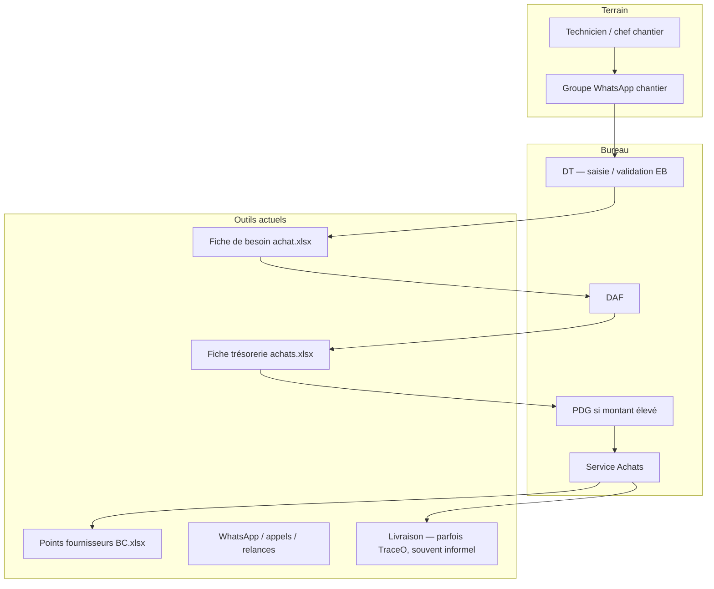
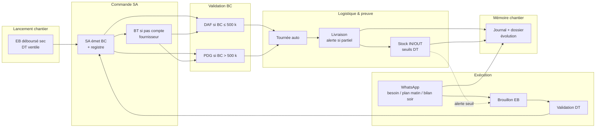

# Étude de l’existant, diagnostic des problématiques et recommandations d’évolution

## Processus d’approvisionnement chantier

---


|                      |                                                                                                    |
| -------------------- | -------------------------------------------------------------------------------------------------- |
| **Document**         | Étude AS-IS / diagnostic / recommandations TO-BE                                                   |
| **Version**         | 1.2 — 20 août 2026 (CDC F01–F07, F09 ; F08/F10 hors TraceO ; F01.1 hors prod)                      |
| **Périmètre**        | Approvisionnement matériaux chantier BTP — pilote TraceO Achats Chantier                           |
| **Public**           | Board des gestionnaires, DT, DAF, SA, PDG, CdG, direction exploitation                             |
| **Plateforme cible** | TraceO® — extension du module livraison existant                                                   |
| **Statut**           | Circuit achats opérationnel (tenant pilote, hors prod) ; F01.1 développé hors prod                 |
| **Sources**          | Fiches SA, CDC Fadym, entretien DT, questionnaire finance, règles métier BTP                       |


**Documents dérivés :**

- [BTP-INDEX.md](./BTP-INDEX.md) — **table des matières** de la documentation BTP  
- [BTP-SYNTHESE-EXECUTIVE-DIRECTION.md](./BTP-SYNTHESE-EXECUTIVE-DIRECTION.md) — **synthèse exécutive direction**  
- [BTP-SPEC-F01-FICHE-CHANTIER-BUDGET.md](./BTP-SPEC-F01-FICHE-CHANTIER-BUDGET.md) — fiche affaire CdG (F01)  
- [BTP-RETEX-QUESTIONNAIRE-FINANCE-2026.md](./BTP-RETEX-QUESTIONNAIRE-FINANCE-2026.md)  
- [BTP-DECISIONS-DT-VALIDEES.md](./BTP-DECISIONS-DT-VALIDEES.md)  
- [BTP-REGLES-CIRCUIT-ACHATS.md](./BTP-REGLES-CIRCUIT-ACHATS.md)  
- [BTP-REGLES-TOURNEES-BC.md](./BTP-REGLES-TOURNEES-BC.md)  
- [BTP-REGLES-STOCK-CHANTIER.md](./BTP-REGLES-STOCK-CHANTIER.md)  
- [BTP-WHATSAPP-DOSSIER-CHANTIER.md](./BTP-WHATSAPP-DOSSIER-CHANTIER.md)  
- [BTP-PRESENTATION-BOARD.md](./BTP-PRESENTATION-BOARD.md)

---

## Table des matières

1. [Résumé exécutif](#resume-executif)
2. [Contexte, objet et périmètre](#1-contexte-objet-et-perimetre)
3. [Étude de l’existant (AS-IS)](#2-etude-de-lexistant-as-is)
4. [Diagnostic des problématiques](#3-diagnostic-des-problematiques)
5. [Recommandations d’évolution (TO-BE)](#4-recommandations-devolution-to-be)
6. [Plan de déploiement recommandé](#5-plan-de-deploiement-recommande-pilote)
7. [Synthèse décisionnelle](#6-synthese-decisionnelle)
8. [Annexes](#annexes)

Index de toute la documentation BTP : [BTP-INDEX.md](./BTP-INDEX.md).

---

## Résumé exécutif


### Constat principal

L’approvisionnement chantier fonctionne aujourd’hui grâce à l’**expérience des équipes** et à une **lourde charge de ressaisie** entre WhatsApp (terrain), Excel (bureau) et coordination téléphonique (livraisons). WhatsApp est **irremplaçable** comme outil de travail ; le circuit achats repose sur **trois fiches Excel** de référence (besoin, trésorerie, registre BC) et des validations humaines dispersées (DT, DAF, SA, PDG).

TraceO couvre déjà la **preuve de livraison** (photos, quantités, OTP) pour la distribution, mais cette capacité n’est **pas reliée** au circuit achats chantier. **Le service financier et le contrôleur de gestion vérifient le décaissement et le reçu d’achat, pas la concordance avec ce qui est réellement livré sur le chantier** — c’est précisément le trou que TraceO doit combler.

Il en résulte des ruptures de traçabilité, des livraisons partielles mal visibles, une absence de stock structuré et une faible visibilité sur l’évolution des chantiers.

### Diagnostic en trois axes


| Axe           | Problème central                                                     |
| ------------- | -------------------------------------------------------------------- |
| **Processus** | Double saisie, statuts invisibles, BC déconnecté de la livraison     |
| **Outils**    | Excel + WhatsApp sans mémoire structurée ; pas de dossier chantier   |
| **Pilotage**  | Pas d’alerte livraison partielle ; stock oral ; commandes en urgence |
| **Contrôle**  | Finance vérifie reçu/décaissement — **pas** livraison chantier       |


### Recommandation stratégique

**Ne pas remplacer WhatsApp ni les fiches Excel SA**, mais les **industrialiser** via TraceO :

> **WhatsApp (intrant) → EB validée → approbations → BC → tournée livreur → réception prouvée → stock → alertes → dossier chantier**

La solution s’appuie sur le **moteur tournées/livreur existant**. Ce n’est **pas** un ERP SYSCOHADA (**F08**) ni un module marchés sous-traitants (**F10**). Le CDC Fadym **F01–F07 et F09** est le cadre fonctionnel TraceO — voir [synthèse §4](./BTP-SYNTHESE-EXECUTIVE-DIRECTION.md).

### Décisions déjà validées par le DT (août 2026)

1. **Déboursé sec** au lancement : enveloppe globale **ventilée en lignes produits par le DT** avant approbation DAF.
2. **Journal quotidien** technicien : **WhatsApp** (plan matin, bilan soir + matériel utilisé).
3. **Alertes livraison** : **WhatsApp + dashboard** ; priorité si livraison partielle.
4. **Seuils stock** : définis par le **DT** ; alertes WhatsApp + dashboard.


### Faits confirmés SA / Finance (août 2026)


| Règle                        | Détail                                                                                  |
| ---------------------------- | --------------------------------------------------------------------------------------- |
| **BT**                       | Produit quand **FADYM n’a pas de compte** chez le fournisseur — SA achète en présentiel |
| **PDG**                      | Si montant **> 500 000 FCFA**                                                           |
| **Pas d’achat hors circuit** | Finance + contrôleur de gestion sur reçu ; jamais de BC après achat                     |
| **Validations WA**           | Capture d’écran jointe au dossier si signataire absent                                  |
| **Valeur TraceO**            | Relier **BC → livraison prouvée → qtés chantier** (trou actuel)                         |


Retex complet : [BTP-RETEX-QUESTIONNAIRE-FINANCE-2026.md](./BTP-RETEX-QUESTIONNAIRE-FINANCE-2026.md)

### Prochaine étape proposée

Lancer un **pilote sur 1 chantier** (tenant isolé `co-btp-pilote`), avec validation board du budget Meta/WhatsApp, charte pont transfert, et revue à J+30.

---


## 1. Contexte, objet et périmètre


### 1.1 Contexte

L’entreprise cible gère des **chantiers BTP simultanés**. Chaque chantier consomme des matériaux (ciment, fer, sable, etc.) selon un rythme variable. L’expression du besoin se fait **majoritairement sur WhatsApp** ; le contrôle financier et la commande fournisseur passent par un circuit structuré impliquant le **directeur technique (DT)**, le **DAF**, le **service achats (SA)** et, selon les montants, le **PDG**.

La plateforme **TraceO** est déjà déployée pour la **traçabilité des livraisons** (PWA livreur, dashboard manager, certificats). L’extension **Achats chantier** vise à **enchaîner** le besoin matériaux jusqu’à la preuve de réception, sans ressaisie et sans retirer WhatsApp.

### 1.2 Objet du document

Ce document vise à :

1. **Décrire l’existant** (organisation, processus, outils, documents) ;
2. **Diagnostiquer** les dysfonctionnements et leurs impacts ;
3. **Formuler des recommandations d’évolution** argumentées, phasées et alignées sur les contraintes terrain ;
4. Servir de **base de décision** pour le board et les valideurs métier (DAF, SA).


### 1.3 Périmètre inclus


| Inclus                                               | Exclu                                          |
| ---------------------------------------------------- | ---------------------------------------------- |
| Expression de besoin (EB) — déboursé sec et courante | **F08** — ERP comptable / SYSCOHADA            |
| Circuit approbation DAF / BT / PDG / SA              | **F10** — marchés ST, situations, RG           |
| **F01** enveloppe CdG (budget, avenants, engagé)     | RH, paie                                       |
| **F02–F07, F09** (backlog après F01)                 | Planification ouvrages (Gantt, BIM)            |
| BC, registre fournisseurs, exports Excel SA          | Lecture passive intégrale des groupes WhatsApp |
| Tournées livreur liées au BC                         | Multi-dépôts, valorisation FIFO                |
| Preuve livraison, alertes partielles                 | Transferts stock inter-chantiers               |
| Stock chantier (phases progressives)                 |                                                |
| Dossier chantier (journal, évolution)                |                                                |


### 1.4 Méthodologie


| Source                                              | Contribution                                   |
| --------------------------------------------------- | ---------------------------------------------- |
| Analyse des **fiches Excel SA** (`docs/originaux/`) | Modèle AS-IS documentaire                      |
| **Entretien DT** (août 2026)                        | Besoins opérationnels, arbitrages D1–D4        |
| **Questionnaire SA / Finance** (août 2026)          | AS-IS confirmé — seuil PDG, espèces, contrôles |
| **Tenant pilote** `co-btp-pilote` (hors prod)       | Circuit EB→BC + **F01.1** enveloppe            |
| **CDC Fadym** (`docs/originaux/`)                   | F01–F10 ; TraceO = F01–F07 et F09              |
| Rédaction collaborative des **règles métier BTP**   | Formalisation des recommandations              |


---


## 2. Étude de l’existant (AS-IS)


### 2.1 Acteurs et responsabilités


| Rôle                              | Responsabilités actuelles dans l’approvisionnement                                                                                                                                  |
| --------------------------------- | ----------------------------------------------------------------------------------------------------------------------------------------------------------------------------------- |
| **Technicien / chef de chantier** | Exprime le besoin sur WhatsApp ; reçoit les livraisons ; estime le stock « à l’œil » ; informe oralement des avancements                                                            |
| **DT**                            | Relève les besoins WhatsApp ; **ressaisit** la fiche EB Excel ; valide le besoin métier ; suit les livraisons sans vue consolidée ; lance le **déboursé sec** au démarrage chantier |
| **DAF**                           | Valide le **BC émis** (≤ 500 k) ; dossier **BC + BT + pro forma** si pas de compte ; signature ou WhatsApp + capture |
| **PDG**                           | Valide le **BC émis** (> 500 k) ; même règle dossier BT / pro forma |
| **SA**                            | **Seul habilité à acheter** ; émet BC, registre ; joint **pro forma** si BT ; **envoie photo BC au fournisseur après validation DAF/PDG** ; achats espèces en présentiel |
| **Service financier**             | Conformité **décaissement + reçu** post-achat — **ne vérifie pas** concordance décaissé ↔ livré chantier                                                                            |
| **Contrôleur de gestion**         | Contrôle conformité (avec finance)                                                                                                                                                  |
| **Livreur / chauffeur**           | **Livraison uniquement** — n’effectue **pas** d’achats ; pas de gestion de monnaie achat                                                                                            |
| **Direction**                     | Vision partielle ; arbitrages sans données consolidées bout en bout                                                                                                                 |


### 2.2 Processus actuel — vue d’ensemble




### 2.3 Deux moments distincts du processus (confirmé DT)

Le processus n’est pas homogène sur la durée de vie du chantier :

#### A. Lancement chantier — déboursé sec


| Étape | Acteur  | Action actuelle                                                                  |
| ----- | ------- | -------------------------------------------------------------------------------- |
| 1     | **DT**  | Émet une EB **déboursé sec** ventilée en lignes produits                         |
| 2     | **SA**  | Émet le(s) BC, enregistre au registre                                            |
| 3     | **DAF / PDG** | Valide le **BC émis** (seuil 500 k) — signature ou WhatsApp + capture      |


**Précision validée DT :** le déboursé sec est une **enveloppe globale**, mais le DT doit **ventiler le montant en lignes produits** (libellé, quantité, unité, montant) **avant** transmission au SA. Le contrôle financier (DAF/PDG) intervient **sur le BC émis**.

#### B. Exécution chantier — besoins courants


| Étape | Acteur                    | Action actuelle                        |
| ----- | ------------------------- | -------------------------------------- |
| 1     | Technicien                | Message WhatsApp (texte, vocal, photo) |
| 2     | DT                        | Ressaisie dans fiche EB Excel          |
| 3     | SA                        | Émet BC + registre                     |
| 4     | DAF → PDG (si seuil)      | **Validation du BC** après émission    |
| 5     | SA / livreur / chantier   | Envoi fournisseur, livraison           |


### 2.4 Documents de référence (Service Achats)

Analyse des modèles dans `docs/originaux/` :


| Document                       | Rôle                                                                             | Producteur                            | Fréquence       |
| ------------------------------ | -------------------------------------------------------------------------------- | ------------------------------------- | --------------- |
| **Fiche de besoin achat**      | EB — lignes, site, objet, fournisseur, mode paiement                             | DT saisit ; SA formalise              | À chaque besoin |
| **Fiche trésorerie achats**    | BT — avance, validations DAF/PDG                                                 | SA — selon mode paiement / trésorerie | Selon montant   |
| **Points fournisseurs des BC** | Registre mensuel : chantier, fournisseur, n° BC, mode paiement, montant, facture | SA — **une ligne par BC**             | Continu         |


Ces documents constituent la **langue métier** du board et de la compta ; toute évolution doit **continuer à les produire**, idéalement **sans ressaisie**.

### 2.5 Outils et canaux actuels


| Canal / outil                  | Usage                                   | Limite observée                                                     |
| ------------------------------ | --------------------------------------- | ------------------------------------------------------------------- |
| **WhatsApp (groupe chantier)** | Besoins, photos, urgences, coordination | Pas d’archive structurée ; messages perdus ; pas de statut commande |
| **Excel (EB, BT, registre)**   | Référence officielle achats             | Double saisie ; versions multiples ; pas de lien livraison          |
| **Téléphone / appels**         | Relances SA–livreur–chantier            | Non tracé                                                           |
| **TraceO (livraison)**         | Preuve si tournée planifiée             | **Non connecté** au BC / EB chantier                                |
| **Stock chantier**             | Aucun outil                             | Estimation orale ; ruptures tardives                                |


### `2.6 Couverture fonctionnelle actuelle vs cible`


| Fonction                  | AS-IS                                   | Gap                                              |
| ------------------------- | --------------------------------------- | ------------------------------------------------ |
| Capture besoin WhatsApp   | Manuel (DT ressaisit)                   | Automatisation brouillon + validation DT         |
| Déboursé sec lancement    | Excel, circuit DT→DAF→SA                | EB typée, ventilation contrôlée, workflow TraceO |
| Circuit approbation       | Hors système (e-mail, WhatsApp, papier) | File d’approbation tracée                        |
| BC / BT / registre        | Excel saisi par SA                      | Exports auto depuis TraceO                       |
| Tournée depuis BC         | SA coordonne manuellement               | Création auto + file exceptions                  |
| Preuve livraison          | TraceO partiel                          | Lien BC ↔ tournée ↔ certificat                   |
| Qtés livrées / partielles | Non consolidé pour le DT                | Notification WhatsApp + dashboard                |
| Stock chantier            | Aucun                                   | Entrée à livraison ; sortie bilan soir           |
| Dossier chantier          | Fil WhatsApp uniquement                 | Journal + timeline + évolution                   |


### 2.8 Précisions questionnaire SA / Finance (août 2026)

Retex détaillé : [BTP-RETEX-QUESTIONNAIRE-FINANCE-2026.md](./BTP-RETEX-QUESTIONNAIRE-FINANCE-2026.md)


| Fait confirmé                                                                     | Conséquence                                                          |
| --------------------------------------------------------------------------------- | -------------------------------------------------------------------- |
| **Seuil PDG : > 500 000 FCFA** (DAF si ≤)                                         | Corriger l’hypothèse 1 M documentée précédemment                     |
| Finance + contrôleur de gestion : **reçu + décaissement**, pas livraison chantier | TraceO apporte le **lien BC → réception prouvée** absent aujourd’hui |
| **SA seul** achète ; espèces = **présentiel SA** ; monnaie → finance + reçu       | Pas d’achat chauffeur ; tournée TraceO = **livraison**, pas paiement |
| Validations **WhatsApp + capture d’écran** si absent                              | TraceO doit **archiver** ces preuves d’approbation                   |
| **Toute EB est urgente** ; pas de blocage signature multi-jours                   | Priorisation chantier, pas file d’attente signature                  |
| **BL fournisseur** à la livraison ; appel si partiel                              | Intégrer BL (photo/qtés) au dossier + alertes partielles             |
| **Jamais** de BC après achat                                                      | Invariant strict                                                     |
| Délai EB→BC ≈ rédaction SA + validation DAF/PDG + **photo BC au fournisseur** WhatsApp | Gain TraceO = ressaisie ; délai validation inchangé |


### 2.9 Règles BT et PDG (confirmées — août 2026)

Deux règles **indépendantes** — ne pas les confondre :


| Document / validation     | Condition                                   | Conséquence opérationnelle                                                                       |
| ------------------------- | ------------------------------------------- | ------------------------------------------------------------------------------------------------ |
| **BT** (fiche trésorerie) | **Pas de compte** FADYM chez le fournisseur | SA achète **en présentiel** ; validation finance sur **BC + BT + facture pro forma** |
| **PDG**                   | Montant **BC** **> 500 000 FCFA**                  | Validation **PDG du BC** après émission SA                                                       |
| **DAF seul**              | Montant **BC** ≤ 500 k                             | Validation **DAF du BC** après émission SA ; tournée auto possible après validation (crédit)     |


**Recommandation TraceO :** exiger `supplier_id` sur l’EB **avant** validation DAF lorsque le fournisseur est connu, pour générer le BT et router le circuit correctement.

---


### 2.7 Pratiques terrain complémentaires (retex DT)


| Pratique                    | Description AS-IS                                                                                  |
| --------------------------- | -------------------------------------------------------------------------------------------------- |
| **Plan de journée**         | Le technicien communique oralement ou sur WhatsApp les tâches du matin — non centralisé            |
| **Bilan de fin de journée** | Travail réalisé et matériel consommé communiqués oralement — stock non mis à jour systématiquement |
| **Suivi livraisons**        | Le DT n’a pas de vue fiable des quantités livrées (partielles ou totales) par chantier             |
| **Seuils matériaux**        | Pas d’alerte formalisée ; commandes souvent déclenchées en urgence                                 |


---


## 3. Diagnostic des problématiques


### 3.1 Cartographie des dysfonctionnements


| ID      | Problématique                      | Cause racine                         | Impact                             | Acteurs touchés        | Criticité   |
| ------- | ---------------------------------- | ------------------------------------ | ---------------------------------- | ---------------------- | ----------- |
| **P1**  | Double saisie WhatsApp → Excel EB  | Absence d’intrant structuré          | Erreurs qté, retard DT             | DT, technicien         | **Élevée**  |
| **P2**  | Pas de source de vérité            | Données dispersées (Excel, WA, oral) | Litiges, audits difficiles         | DAF, direction         | **Élevée**  |
| **P3**  | Statuts commande invisibles        | Pas de workflow partagé              | Relances, interruption chantier    | Tous                   | **Élevée**  |
| **P4**  | BC déconnecté de la livraison      | Pas de lien BC → tournée TraceO      | Camion sans preuve structurée      | SA, chantier           | **Élevée**  |
| **P5**  | Livraisons partielles peu visibles | Pas d’alerte consolidée              | Retard complément ; stock faux     | DT, SA                 | **Élevée**  |
| **P6**  | Registre fournisseurs ressaisi     | BC et registre hors système          | Charge SA, incohérences            | SA                     | **Moyenne** |
| **P7**  | Ruptures stock                     | Pas de stock ni seuil                | Arrêt chantier, surcoût urgence    | DT, exploitation       | **Élevée**  |
| **P8**  | Multi-BC même fournisseur          | Pas de consolidation logistique      | Trajets redondants                 | SA, livreur            | **Moyenne** |
| **P9**  | Mémoire chantier dans WhatsApp     | Pas de dossier structuré             | Perte d’info ; direction aveugle   | DT, direction          | **Moyenne** |
| **P10** | Circuit BT/PDG peu lisible         | Seuil et validations hors outil      | Retards paiement                   | DAF, PDG               | **Moyenne** |
| **P11** | **Décaissé ≠ livré chantier**      | Finance ne contrôle pas la réception | Angle mort audit ; DT sans recoupe | Finance, DT, direction | **Élevée**  |


### 3.2 Analyse par thème


#### 3.2.1 Rupture de la chaîne de valeur

Le processus d’approvisionnement forme une chaîne :

```
Besoin → Validation → Commande → Logistique → Réception → Stock → Anticipation
```

Aujourd’hui, chaque maillon utilise des **outils différents non reliés**. La valeur de TraceO (preuve livraison) est **en aval déconnectée** de la commande (BC). Le diagnostic identifie cette **rupture BC–livraison** comme le dysfonctionnement structurel principal.

#### 3.2.2 Charge cognitive et coût caché


| Poste de charge  | Manifestation                                   |
| ---------------- | ----------------------------------------------- |
| Temps DT         | Ressaisie EB, relances, suivi oral livraisons   |
| Temps SA         | Registre, coordination livreur hors BC          |
| Temps direction  | Arbitrages sans données consolidées             |
| Risque financier | Commandes urgence, pénalités chantier à l’arrêt |
| Risque audit     | Traçabilité incomplète besoin → preuve          |


#### 3.2.3 WhatsApp : atout sous-exploité

WhatsApp n’est pas le problème — c’est **l’absence de couche structurante** au-dessus. Les messages contiennent besoins, photos d’avancement, alertes stock et bilans de journée, mais **aucun système** ne les classe, archive et relie aux workflows (EB, livraison, stock).

**Contrainte non négociable :** WhatsApp **reste** le canal terrain. Toute recommandation doit **capturer** WhatsApp, pas le remplacer.

#### 3.2.4 Stock : angle mort opérationnel

Sans stock structuré :

- les **entrées** (livraisons) ne alimentent pas un solde fiable ;
- les **sorties** (consommation) ne sont pas enregistrées quotidiennement ;
- les **seuils** n’existent pas → commandes tardives.

Le retex DT confirme la volonté d’un **bilan soir WhatsApp** (matériel utilisé) pour mettre à jour les quantités disponibles.

#### 3.2.5 Trou finance ↔ chantier (confirmé questionnaire)

Le **service financier** et le **contrôleur de gestion** contrôlent :

- la conformité du **décaissement** ;
- le **reçu** transmis après l’achat.

Ils **ne vérifient pas** que le montant décaissé correspond au matériel **effectivement reçu sur le chantier**. Aujourd’hui, seuls l’**appel fournisseur** (livraison partielle) et le **bon de livraison (BL)** à la réception permettent une recoupe terrain — sans centralisation.

**Recommandation centrale TraceO :** établir la chaîne **BC → tournée → preuve livreur (photos, qtés) → BL → stock IN** comme **contrepartie opérationnelle** au contrôle financier du reçu — sans remplacer la compta.

### 3.3 Matrice effort / impact des recommandations


| Recommandation                                 | Impact métier | Effort | Priorité pilote |
| ---------------------------------------------- | ------------- | ------ | --------------- |
| Lien **BC → livraison prouvée** (trou finance) | Très élevé    | Moyen  | **P0**          |
| WhatsApp → brouillon EB → validation DT        | Très élevé    | Moyen  | **P0**          |
| EB déboursé sec ventilée → SA → BC → DAF/PDG     | Élevé         | Faible | **P0**          |
| BC → tournée auto                              | Très élevé    | Moyen  | **P0**          |
| Exports Excel SA auto                          | Élevé         | Moyen  | **P0**          |
| Alertes livraison (partiel) WA + dashboard     | Élevé         | Faible | **P1**          |
| Journal quotidien WhatsApp (matin/soir)        | Élevé         | Moyen  | **P1**          |
| Stock entrée à livraison + seuils DT           | Élevé         | Moyen  | **P1**          |
| Dossier chantier / timeline                    | Moyen         | Moyen  | **P2**          |
| Consolidation multi-BC                         | Moyen         | Élevé  | **P2** (J1+)    |


### 3.4 Risques du statu quo


| Risque                                        | Probabilité | Conséquence                       |
| --------------------------------------------- | ----------- | --------------------------------- |
| Rupture matériaux non anticipée               | Élevée      | Arrêt chantier, surcoût           |
| Litige livraison partielle                    | Moyenne     | Retard, tension fournisseur       |
| Non-conformité audit / travaux publics        | Moyenne     | Réputation, pénalités             |
| Perte d’informations WhatsApp                 | Élevée      | Décisions sur données incomplètes |
| Double investissement logiciel (ERP + TraceO) | Moyenne     | Coût, rejet terrain               |


---


## 4. Recommandations d’évolution (TO-BE)


### 4.1 Vision cible

> **Le technicien continue sur WhatsApp. Le DT valide. Le SA émet le BC. Le DAF ou le PDG valide le BC dans une file tracée. TraceO émet les documents SA, crée la mission livreur, enregistre la preuve, met à jour le stock et alerte avant la rupture. Le dossier chantier conserve toute l’information pertinente.**

**Principes directeurs :**

1. **WhatsApp-first** — intrant unique terrain ; pont transfert / réponse au numéro TraceO.
2. **Validation humaine** aux points d’audit (DT, DAF, SA, PDG).
3. **Documents SA conservés** — générés, pas ressaisis.
4. **BC = déclencheur logistique** — tournée auto si règles OK.
5. **Une preuve = une livraison TraceO** — continuité avec l’existant.
6. **Stock progressif** — entrée à livraison ; sortie bilan soir ; seuils DT.
7. **Tenant pilote isolé** — pas de mélange avec démo / autres métiers.


### 4.2 Processus cible — schéma global




### 4.3 Recommandations processus


#### R1 — Formaliser les deux types d’EB


| Type                   | Initiateur                        | Contenu                                                         | Circuit                                     |
| ---------------------- | --------------------------------- | --------------------------------------------------------------- | ------------------------------------------- |
| **Déboursé sec**       | DT                                | Enveloppe ventilée en **lignes produits** (qté, unité, montant) | DT → SA → BC → DAF/PDG                      |
| **Courante**           | Technicien (WhatsApp) → brouillon | Besoin ponctuel ou urgence                                      | Brouillon → DT → SA → BC → DAF/PDG          |
| **Anticipation stock** | Système (sous seuil)              | EB suggérée                                                     | Brouillon → **DT valide** → suite identique |


**Contrôle déboursé sec :** transmission SA bloquée si ventilation absente ou total ≠ somme des lignes.

#### R2 — Industrialiser WhatsApp sans le retirer


| Recommandation                                | Détail                                                       |
| --------------------------------------------- | ------------------------------------------------------------ |
| Pont **transfert / réponse** au numéro TraceO | Fiable vs lecture passive groupe (API Meta non garantie)     |
| Classification des messages                   | EB, plan jour, bilan soir, photo avancement, stock bas       |
| Accusés dans le groupe                        | « EB-0142 enregistrée — en attente DT »                      |
| Journal chantier                              | Archive horodatée de tout message utile + événements système |


#### R3 — Relier BC, tournée et preuve


| Règle                              | Description                                                                                  |
| ---------------------------------- | -------------------------------------------------------------------------------------------- |
| **BC émis → tournée auto**         | Si conditions OK (crédit, fournisseur compte, etc.)                                          |
| **File « À planifier »**           | Cas espèces, particulier, données incomplètes                                                |
| **Consolidation J1+**              | N BC même fournisseur → 1 tournée, N arrêts (logistique seulement ; 1 ligne registre par BC) |
| **Livraison confirmée → stock IN** | Quantité livrée déclarée par le livreur                                                      |


#### R4 — Informer le DT sur les livraisons (validé D3)


| Événement               | Dashboard                                 | WhatsApp             |
| ----------------------- | ----------------------------------------- | -------------------- |
| Livraison totale        | Récap qté par ligne                       | Message informatif   |
| Livraison **partielle** | Alerte prioritaire + action EB complément | **Alerte immédiate** |
| Livraison refusée       | Alerte                                    | Alerte               |


#### R5 — Journal quotidien et stock (validé D2, D4)


| Moment           | Canal                                         | Effet                                     |
| ---------------- | --------------------------------------------- | ----------------------------------------- |
| **Matin**        | WhatsApp — plan de journée                    | Journal chantier ; visibilité DT          |
| **Soir**         | WhatsApp — travail réalisé + matériel utilisé | Sorties stock `OUT` ; réévaluation seuils |
| **Seuils**       | Définis par le **DT** par produit / chantier  | Alerte WhatsApp + dashboard si sous seuil |
| **Anticipation** | EB **suggérée** (pas de commande auto)        | DT valide toujours                        |


#### R6 — Conserver et générer les documents SA

TraceO **exporte** :

- Fiche **besoin achat** (lignes EB, y compris déboursé sec ventilé) ;  
- Fiche **trésorerie** (BT) si **pas de compte** chez le fournisseur ;  
- Lignes **registre fournisseurs** (1 ligne = 1 BC).

Le SA **ne retape pas** ; il valide, complète si besoin (fournisseur, mode paiement) et émet le BC.

#### R7 — Dossier chantier et évolution

Centraliser dans une **timeline** par chantier :

- messages WhatsApp capturés ;  
- EB / BC / livraisons ;  
- photos d’avancement ;  
- mouvements stock ;  
- jalons DT (phases travaux).

Objectif : voir le **niveau d’évolution** sans parcourir des mois de messages groupe.

#### R8 — Règles BT et PDG (confirmées finance)


| Règle              | Condition                               | TraceO                                                          |
| ------------------ | --------------------------------------- | --------------------------------------------------------------- |
| **BT**             | Pas de compte FADYM chez le fournisseur | Génération BT ; SA achat présentiel ; pas tournée auto standard |
| **PDG**            | Montant **> 500 000 FCFA**              | Étape approbation PDG                                           |
| **Fournisseur EB** | Connu avant DAF                         | `supplier_id` obligatoire si achat sans compte                  |
| **Validation WA**  | Absence signataire                      | Archiver capture d’écran sur l’approbation                      |
| **BL**             | À la livraison                          | Photo + qtés dans dossier ; alertes partielles                  |


#### R9 — Combler le trou finance ↔ chantier

Le contrôle financier porte sur le **reçu** ; TraceO porte sur la **réception chantier** :

> *« Finance a le reçu. TraceO a la preuve que le matériel est sur le chantier. »*

Chaîne cible : **BC → tournée (si crédit) → preuve livreur → BL → stock IN → alertes DT**.

### 4.4 Recommandations organisationnelles


| #   | Recommandation                                                          |
| --- | ----------------------------------------------------------------------- |
| O1  | Désigner un **chantier pilote** unique (1 groupe WhatsApp = 1 chantier) |
| O2  | **Formation terrain** 5 min : pont WhatsApp + formats plan/bilan jour   |
| O3  | **Référent DT** dossier chantier (jalons, messages ambigus)             |
| O4  | Point hebdo DT–SA–exploitant pendant 4 semaines pilote                  |
| O5  | Revue board à **J+30** avant extension multi-chantiers                  |


### 4.5 Recommandations techniques (TraceO)


| Composant              | État actuel     | Recommandation                                                      |
| ---------------------- | --------------- | ------------------------------------------------------------------- |
| PWA Livreur            | Opérationnel    | Réutiliser tel quel — enlèvement fournisseur → chantier             |
| Dashboard manager      | Opérationnel    | Onglets **Achats chantier**, **Suivi chantier** (enveloppe F01)     |
| Extension BTP          | Tenant pilote (hors prod) | Circuit EB → BC opérationnel ; F01.1 enveloppe ; F02–F09 backlog |
| Tenant `co-btp-pilote` | Seed existant   | Isolation données ; pas de mélange démo                             |
| WhatsApp Meta Business | À configurer    | Budget plafonné ; webhook + pont                                    |
| IA (brouillon EB)      | Prototype       | Brouillon uniquement — **DT valide toujours**                       |


**Ce que la recommandation n’est pas :** un ERP SYSCOHADA, un remplacement WhatsApp, une commande automatique sans validation DT, une **intégration comptable (F08)** ni un module **marchés sous-traitants / RG (F10)**.

### 4.6 Couverture du CDC Fadym

TraceO reprend les besoins **F01–F07 et F09**. **F08** (comptabilité générale) et **F10** (marchés ST, situations, retenues de garantie) restent **hors périmètre**. Détail et phasage : [synthèse exécutive §4](./BTP-SYNTHESE-EXECUTIVE-DIRECTION.md) · [index](./BTP-INDEX.md).

| ID | Dans TraceO | Commentaire |
|----|-------------|-------------|
| F01 | Oui — F01.1 hors prod | Enveloppe CdG, avenants DT/DAF |
| F02–F06, F09 | Oui — backlog | Après F01 ; F05 via WhatsApp |
| F07 | Oui — canal WhatsApp | Décision DT D2, pas une 3ᵉ appli |
| F08, F10 | Non | ERP / juridique |

### 4.7 Choix stratégiques argumentés


| Sujet            | Choix recommandé                   | Alternative écartée            | Justification                         |
| ---------------- | ---------------------------------- | ------------------------------ | ------------------------------------- |
| Capture WhatsApp | Pont transfert / réponse           | Bot lecture groupe silencieuse | Fiabilité API Meta ; adoption terrain |
| IA               | Brouillon structuré                | Commande auto                  | Audits ; responsabilité DT            |
| Documents SA     | Export Excel identique             | Écrans seuls                   | Habitudes SA ; continuité compta      |
| Registre BC      | 1 ligne = 1 BC                     | Fusion multi-chantiers         | Budget par chantier                   |
| Tournées         | Auto au BC + consolidation J1+     | Coordination téléphonique SA   | Lien BC ↔ preuve ; réalité UBH        |
| Stock            | IN à livraison ; OUT bilan soir    | Stock à la commande            | Évite stock papier ; retex DT         |
| Seuils           | DT définit ; alerte WA + dashboard | Pas d’alerte                   | Anticipation ruptures                 |


---


## 5. Plan de déploiement recommandé (pilote)


### 5.1 Phasage


| Phase  | Durée     | Contenu                                                               | Livrable                 |
| ------ | --------- | --------------------------------------------------------------------- | ------------------------ |
| **0**  | 2 sem.    | Validation board, charte WhatsApp, Meta Business, onboarding chantier | Go / no-go pilote        |
| **1**  | 8–12 sem. | WhatsApp → EB → déboursé sec → SA → BC → DAF/PDG → tournée ; exports SA | Flux achats bout en bout |
| **1b** | +2–4 sem. | Consolidation multi-BC même fournisseur                               | Optimisation logistique  |
| **F01** | Fait hors prod | Enveloppe CdG, avenants DT/DAF, engagé / reste                      | Fiche affaire            |
| **F02–F04, F09** | Après F01 | Natures, écarts, % financier, vue multi-chantiers                   | Tableau CdG / direction  |
| **2**  | +4 sem.   | Stock S0–S1 : entrée auto, seuils DT, alertes                         | Visibilité stock         |
| **2b / F05–F07** | +4 sem. | Bilan soir WhatsApp → OUT ; jalons physiques                          | Anticipation + avancement |
| **F06** | Après F04+F05 | Alerte dérive financier vs physique                                 | Badge + WhatsApp DT      |
| **3**  | +4 sem.   | Dossier chantier, galerie photos                                      | Vue direction            |
| **F08, F10** | — | Comptabilité générale ; marchés ST / RG                             | **Hors TraceO**          |


### 5.2 Prérequis avant phase 1

- [ ] Board : périmètre pilote, budget Meta/IA, seuil PDG **500 000 FCFA**  
- [ ] DAF : validation circuit déboursé sec ventilé  
- [ ] SA : validation format exports Excel  
- [ ] DT : liste produits pilote (3–5) + seuils initiaux  
- [ ] Admin : numéro WhatsApp TraceO + mapping groupe ↔ chantier  


### 5.3 Indicateurs de succès (3 mois)


| Indicateur                                   | Cible  |
| -------------------------------------------- | ------ |
| EB WhatsApp sans ressaisie DT (cas standard) | ≥ 70 % |
| BC crédit → tournée sans action SA manuelle  | ≥ 80 % |
| Livraisons avec preuve photo                 | ≥ 90 % |
| DT notifié livraisons partielles < 15 min    | ≥ 95 % |
| Bilans soir WhatsApp / jours ouvrés          | ≥ 60 % |
| Ruptures non anticipées (chantier pilote)    | < 2    |
| Satisfaction DT / SA                         | ≥ 4/5  |


---


## 6. Synthèse décisionnelle


### 6.1 Décisions validées par le DT


| ID     | Décision                                 | Implication                                          |
| ------ | ---------------------------------------- | ---------------------------------------------------- |
| **D1** | Déboursé sec ventilé en lignes par le DT | Contrôles C1–C3 avant envoi DAF                      |
| **D2** | Journal quotidien via WhatsApp           | Formats plan/bilan ; pas de PWA technicien en pilote |
| **D3** | Alertes livraison WhatsApp + dashboard   | Alerte prioritaire si partiel                        |
| **D4** | Seuils stock définis par le DT           | CRUD seuils DT ; SA lecture seule                    |
| **F01** | Enveloppe CdG ; avenant DT/DAF           | F01.1 développé hors prod ; F08/F10 hors TraceO      |


### 6.2 Décisions en attente


| Sujet                        | Valideur                       |
| ---------------------------- | ------------------------------ |
| Lancement pilote 1 chantier  | Board                          |
| Circuit déboursé sec → SA → BC → DAF/PDG | DAF                            |
| Format exports registre / EB | SA                             |
| Budget Meta WhatsApp + IA    | Board                          |
| Seuil PDG **> 500 000 FCFA** | Confirmé questionnaire finance |


### 6.3 Recommandation finale

**Lancer le pilote phase 1** sur **un chantier**, avec :

- WhatsApp comme **intrant officiel** (pont transfert) ;  
- circuit **déboursé sec** et **courant** dans TraceO ;  
- **BC → tournée → preuve** automatisés dans le cas standard ;  
- **alertes livraison** et **stock** selon décisions DT ;  
- **revue formelle à J+30** avant généralisation.

Cette approche **réutilise TraceO livreur**, respecte les **habitudes SA (Excel)** et **ne retire pas WhatsApp** — elle répond aux problématiques P1 à P7 identifiées au §3 avec un effort maîtrisé et un phasage réaliste.

---


## Annexes


### Annexe A — Glossaire


| Terme             | Définition                                                |
| ----------------- | --------------------------------------------------------- |
| **EB**            | Expression de besoin — demande d’achat chantier           |
| **BC**            | Bon de commande fournisseur                               |
| **BT**            | Bon de trésorerie — avance / décaissement                 |
| **Déboursé sec**  | Enveloppe de démarrage chantier — ventilée par le DT      |
| **DT**            | Directeur technique                                       |
| **DAF**           | Directeur administratif et financier                      |
| **SA**            | Service achats                                            |
| **Pont WhatsApp** | Transfert ou réponse au numéro TraceO pour capture fiable |


### Annexe B — Références documentaires


| Document                                                               | Contenu                            |
| ---------------------------------------------------------------------- | ---------------------------------- |
| [BTP-DECISIONS-DT-VALIDEES.md](./BTP-DECISIONS-DT-VALIDEES.md)         | Arbitrages D1–D4                   |
| [BTP-REGLES-CIRCUIT-ACHATS.md](./BTP-REGLES-CIRCUIT-ACHATS.md)         | Types EB, déboursé sec, livraisons |
| [BTP-REGLES-TOURNEES-BC.md](./BTP-REGLES-TOURNEES-BC.md)               | Tournées auto, alertes partielles  |
| [BTP-REGLES-STOCK-CHANTIER.md](./BTP-REGLES-STOCK-CHANTIER.md)         | Stock, bilan soir, seuils          |
| [BTP-WHATSAPP-DOSSIER-CHANTIER.md](./BTP-WHATSAPP-DOSSIER-CHANTIER.md) | Intrant WhatsApp, dossier chantier |
| [BTP-PRESENTATION-BOARD.md](./BTP-PRESENTATION-BOARD.md)               | Synthèse board                     |
| [BTP-PRESENTATION-BOARD-SLIDES.md](./BTP-PRESENTATION-BOARD-SLIDES.md) | Deck 14 slides                     |
| `docs/originaux/*.xlsx`                                                | Modèles SA de référence            |


### Annexe C — Comparatif AS-IS / TO-BE par rôle


| Rôle           | AS-IS                                | TO-BE recommandé                                                                |
| -------------- | ------------------------------------ | ------------------------------------------------------------------------------- |
| **Technicien** | Messages noyés dans le groupe        | Accusés ; plan/bilan WhatsApp ; statuts visibles                                |
| **DT**         | Ressaisie EB ; suivi oral livraisons | Révision brouillon ; déboursé sec ventilé ; alertes WA+dashboard ; seuils stock |
| **DAF**        | Pièces dispersées                    | File d’approbation tracée ; BT si seuil                                         |
| **SA**         | 3 Excel + appels livreur             | BC + registre auto ; file exceptions                                            |
| **Livreur**    | Consignes orales                     | Tournée PWA liée au BC                                                          |
| **Direction**  | Vision partielle                     | Dossier chantier ; KPI pilote                                                   |


---

*Document établi pour appui à la décision — à compléter (nom chantier pilote, baseline chiffrée, signatures) avant diffusion externe.*