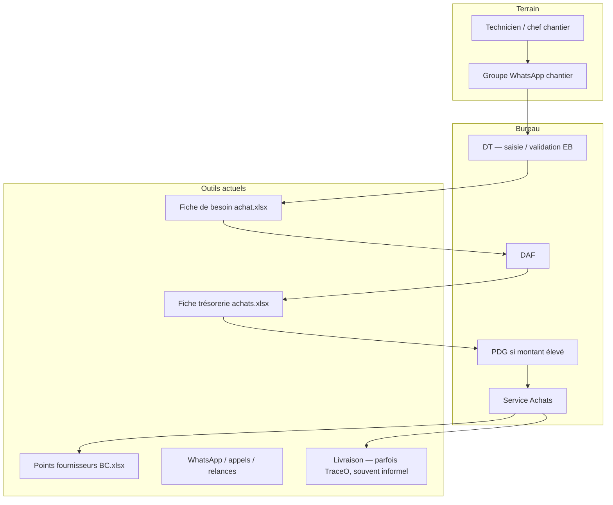
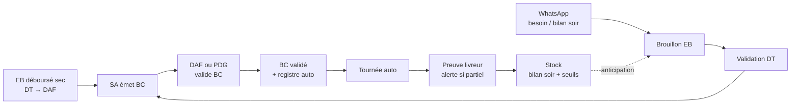

# TraceO Achats Chantier — Présentation au board des gestionnaires

**Document :** synthèse décisionnelle (situation actuelle → cible)  
**Version :** 1.1 — 20 août 2026  
**Public :** board des gestionnaires (DT, DAF, SA, PDG, CdG, direction exploitation)  
**Périmètre :** pilote BTP — achats, livraison, stock, enveloppe CDC (sauf F08, F10)  
**Plateforme :** TraceO® — extension du module livraison existant  

**Documents techniques de référence :**

- [BTP-INDEX.md](./BTP-INDEX.md) — **table des matières** BTP  
- [BTP-SYNTHESE-EXECUTIVE-DIRECTION.md](./BTP-SYNTHESE-EXECUTIVE-DIRECTION.md) — synthèse exécutive (CDC F01–F07, F09)  
- [BTP-SPEC-F01-FICHE-CHANTIER-BUDGET.md](./BTP-SPEC-F01-FICHE-CHANTIER-BUDGET.md) — enveloppe chantier  
- [BTP-ETUDE-EXISTANT-DIAGNOSTIC-RECOMMANDATIONS.md](./BTP-ETUDE-EXISTANT-DIAGNOSTIC-RECOMMANDATIONS.md) — **étude AS-IS, diagnostic, recommandations** (document principal)  
- [BTP-REGLES-CIRCUIT-ACHATS.md](./BTP-REGLES-CIRCUIT-ACHATS.md) — types EB, déboursé sec, circuit DAF  
- [BTP-WHATSAPP-DOSSIER-CHANTIER.md](./BTP-WHATSAPP-DOSSIER-CHANTIER.md) — **WhatsApp intrant** + dossier chantier & évolution  
- [BTP-REGLES-TOURNEES-BC.md](./BTP-REGLES-TOURNEES-BC.md) — tournées automatiques depuis le BC  
- [BTP-REGLES-STOCK-CHANTIER.md](./BTP-REGLES-STOCK-CHANTIER.md) — stock site & commande anticipée  

---

## Table des matières

1. [Synthèse exécutive](#synthese-executive-1-page)
2. [Retex directeur technique](#retex-directeur-technique-aout-2026)
3. [Contexte stratégique](#1-contexte-strategique)
4. [Situation actuelle (AS-IS)](#2-situation-actuelle-as-is)
5. [Problèmes et douleurs](#3-problemes-et-douleurs-pourquoi-changer)
6. [Vision cible (TO-BE)](#4-vision-cible-to-be)
7. [Avantages attendus](#5-avantages-attendus)
8. [Choix stratégiques](#6-choix-strategiques-et-justification)
9. [Roadmap](#7-roadmap-proposee)
10. [Risques](#8-risques-et-mitigations)
11. [Décisions board](#9-decisions-attendues-du-board)
12. [Investissement](#10-investissement-et-effort-humain-ordre-de-grandeur)
13. [Conclusion](#11-conclusion-pour-le-board)
14. [Annexes](#annexe-a--glossaire)

---

## Synthèse exécutive (1 page)

### Constats

- **WhatsApp** est l’outil principal de communication chantier — il ne peut pas être retiré.  
- Le **circuit achats** repose aujourd’hui sur des **fiches Excel** (besoin, trésorerie, registre fournisseurs) et des **allers-retours** entre techniciens, DT, DAF, SA et PDG.  
- **TraceO** prouve déjà les **livraisons** (photos, quantités, OTP) pour la distribution ; l’extension **Achats chantier** vise à **enchaîner** le besoin matériaux jusqu’à cette preuve, sans ressaisie.

### Proposition

Construire un **fil unique** :

> **Besoin WhatsApp → EB validée DT → approbations → BC → tournée livreur → réception chantier → stock (phases)**

avec **validation humaine** aux points d’audit (DT, DAF, SA, PDG) et **documents SA** (fiches Excel) **générés** par le système, pas ressaisis.

### Pourquoi maintenant

- Réduire les **ruptures** et les **commandes en urgence**  
- **Traçabilité** exigée sur chantiers sensibles (travaux publics, audits)  
- **Réutiliser** l’investissement TraceO livreur au lieu d’un silo achats séparé  

### Ce que le board doit trancher

Voir **§9** — pont WhatsApp pilote, périmètre pilote, seuil PDG, phasage stock, budget Meta/IA.

---

## Retex directeur technique (août 2026)

**Décisions validées :** [BTP-DECISIONS-DT-VALIDEES.md](./BTP-DECISIONS-DT-VALIDEES.md)

| Sujet | Règle validée |
|-------|---------------|
| **Lancement chantier** | EB **déboursé sec** — montant global **ventilé en lignes** (DT) → SA → BC → DAF/PDG |
| **Livraisons** | Qtés livrées visibles ; alerte partielle → **WhatsApp + dashboard** |
| **Quotidien terrain** | Matin / soir via **WhatsApp** → stock mis à jour le soir |
| **Seuils stock** | Définis par le **DT** ; alerte **WhatsApp + dashboard** |

---

## 1. Contexte stratégique

### 1.1 Métier visé

Entreprises **BTP / travaux** gérant plusieurs **chantiers** simultanés, avec :

- expression des besoins matériaux **sur le terrain** ;
- circuit d’**approbation** interne (DT, DAF, SA, PDG selon montants) ;
- **bons de commande** fournisseurs (crédit, espèces, chèque) ;
- **livraison** et réception sur site ;
- à terme : **visibilité stock** pour **commander avant la rupture**.

### 1.2 TraceO aujourd’hui (hors BTP)

| Composant | État | Rôle |
|-----------|------|------|
| **PWA Livreur** | Opérationnel, testé | Exécution tournée, photos, OTP, certificat |
| **Dashboard manager** | Opérationnel | Planifier, suivi, catalogue, équipe |
| **Multi-entreprises** | Opérationnel | Isolation des données par société |
| **Extension Achats BTP** | Tenant pilote **hors prod** | WhatsApp → EB → BC → livraison ; **F01.1** enveloppe |

L’extension BTP **s’appuie sur le moteur tournées/livreur existant** ; ce n’est pas un second logiciel.

### 1.3 Contrainte non négociable

**WhatsApp reste le canal terrain.** La solution doit **tirer parti** de WhatsApp (capture, notifications, accusés de réception), pas le remplacer par une application que les techniciens n’adopteront pas.

### 1.4 Couverture du CDC Fadym

TraceO reprend **F01–F07 et F09**. **F08** (comptabilité / SYSCOHADA) et **F10** (marchés ST, situations, RG) restent **hors TraceO**. Détail : [synthèse §4](./BTP-SYNTHESE-EXECUTIVE-DIRECTION.md) · [index](./BTP-INDEX.md).

| ID | Besoin | Dans le pilote |
|----|--------|----------------|
| **F01** | Fiche chantier budget + avenants | **F01.1** hors prod (CdG / DT / DAF) |
| **F02–F04, F09** | Natures, écarts, % financier, multi-chantiers | Backlog après F01 |
| **F05, F07** | Avancement physique ; saisie terrain | **WhatsApp** (décision DT D2) |
| **F06** | Alertes de dérive | Après F04 + F05 |
| **F08, F10** | Comptabilité ; marchés ST / RG | **Hors périmètre** |

---

## 2. Situation actuelle (AS-IS)

### 2.1 Chaîne achats telle qu’elle fonctionne aujourd’hui

### 2.2 Documents SA de référence (`docs/originaux/`)

| Document | Rôle | Producteur |
|----------|------|------------|
| **Fiche de besoin achat** | Expression du besoin (EB) — lignes, site, objet, fournisseur, mode paiement | DT saisit ; SA formalise |
| **Fiche trésorerie achats** | Bon de trésorerie (BT) — si **pas de compte** FADYM chez le fournisseur | SA — achat espèces en présentiel |
| **Points fournisseurs des BC** | Registre mensuel : chantier, fournisseur, n° BC, mode paiement, montant, facture | SA — une ligne par BC |

Ces documents restent la **référence métier** et la **langue du board** ; la cible est de les **alimenter automatiquement** depuis TraceO.

### 2.3 Ce que TraceO couvre déjà vs pas encore

| Étape | Aujourd’hui |
|-------|-------------|
| Expression besoin WhatsApp | **Manuel** — DT ressaisit dans Excel |
| Circuit approbation | **Hors système** — e-mails, WhatsApp, signatures papier |
| BC / BT | **Excel + processus SA** |
| Registre fournisseurs | **Excel** — saisie ligne par ligne |
| Tournée enlèvement → chantier | **TraceO possible** mais **non relié** au BC |
| Preuve réception | **TraceO** si tournée planifiée dans l’app |
| Stock chantier | **Aucun système** — estimation orale |

---

## 3. Problèmes et douleurs (pourquoi changer)

### 3.1 Tableau des douleurs

| # | Douleur | Impact | Qui souffre |
|---|---------|--------|-------------|
| D1 | **Double saisie** — WhatsApp puis Excel EB | Erreurs quantités, retard | DT, technicien |
| D2 | **Pas de source de vérité** — versions Excel, messages perdus | Litiges, audits difficiles | DAF, direction |
| D3 | **Statuts invisibles** — « où en est ma commande ? » | Relances WhatsApp, interruption | Tous |
| D4 | **BC déconnecté de la livraison** | Camion parti sans lien BC ; pas de preuve structurée | SA, chantier |
| D5 | **Registre fournisseurs ressaisi** | Charge SA, incohérences n° BC / montants | SA |
| D6 | **Ruptures stock** — commande tardive | Arrêt chantier, surcoût urgence | Exploitation, DT |
| D7 | **Multi-BC même fournisseur** — plusieurs chantiers | Tournées redondantes ou non tracées | SA, livreur |
| D8 | **Seuil PDG / BT** — circuit flou | Retards paiement, non-conformité manuel financier | DAF, PDG |

### 3.2 Coût caché (ordre de grandeur qualitatif)

- **Temps DT** : ressaisie EB + suivi relances  
- **Temps SA** : registre + coordination livreur hors BC  
- **Temps direction** : arbitrages sans données consolidées  
- **Risque** : chantier à l’arrêt, pénalités, perte de marge  

### 3.3 Ce qu’on ne cherche pas à résoudre en phase 1

- ERP comptable complet  
- Gestion RH / paie  
- Planification fine des ouvrages (Gantt, BIM)  
- Lecture magique de **tous** les messages du groupe sans règle terrain  

---

## 4. Vision cible (TO-BE)

### 4.1 Promesse

> **Le technicien parle sur WhatsApp. Le DT valide. Le SA émet le BC et le registre. TraceO crée la mission livreur et la preuve. Le stock s’enrichit à la livraison et alerte avant la rupture.**

### 4.2 Chaîne cible

**Deux points d’entrée EB :**

| Moment | Circuit |
|--------|---------|
| **Lancement chantier** | DT → EB **déboursé sec** → SA → BC → DAF/PDG → … |
| **Exécution** | WhatsApp → brouillon → DT → SA → BC → DAF/PDG → … |

### 4.3 Principes de la cible

| Principe | Signification pour le board |
|----------|----------------------------|
| **WhatsApp-first** | Intrant unique terrain — achats, photos, stock, avancement ; [dossier chantier](./BTP-WHATSAPP-DOSSIER-CHANTIER.md) |
| **DT gardien métier** | Aucun achat sans validation DT explicite |
| **SA producteur documents** | Fiches Excel **exportées**, pas ressaisies |
| **BC = déclencheur logistique** | Tournée auto **après validation DAF/PDG du BC** (règles + exceptions) |
| **Une preuve = une livraison TraceO** | Continuité avec l’existant |
| **Stock = phase progressive** | Après livraisons fiables |
| **Tenant pilote isolé** | Pas de mélange avec démo / autres métiers |

---

## 5. Avantages attendus

### 5.1 Par rôle

| Rôle | Avant | Après |
|------|-------|-------|
| **Technicien** | Message noyé dans le groupe ; pas de retour | Accusé réception ; statuts dans le groupe |
| **DT** | Ressaisie EB | **Révision** brouillon (original + lignes pré-remplies) |
| **DAF / PDG** | Relances, pièces dispersées | File d’approbation BC (± BT + pro forma) ; historique tracé |
| **SA** | 3 Excel + coordination livreur | BC + registre auto ; envoi photo fournisseur **après** validation |
| **Livreur** | Instructions orales | Tournée dans la PWA (dépôt fournisseur → chantier) |
| **Direction** | Vision partielle | Tableau de bord : EB, livraisons, **dossier chantier** (timeline + évolution) |

### 5.2 Bénéfices organisationnels

1. **Traçabilité audit** — qui a demandé, validé, commandé, livré, quand  
2. **Réduction ressaisie** — gain temps DT et SA  
3. **Moins de ruptures** — stock + commande anticipée (phase S1–S2)  
4. **Optimisation logistique** — consolidation multi-BC même fournisseur (§6.4)  
5. **Actif unique** — TraceO livraison + achats, pas deux outils  
6. **Évolutivité** — pilote 1 chantier → multi-chantiers → stock avancé  

### 5.3 Indicateurs de succès pilote (proposés)

| Indicateur | Cible 3 mois |
|------------|----------------|
| EB issues WhatsApp avec ressaisie DT nulle (cas standard) | ≥ 70 % |
| Délai besoin WhatsApp → BC émis | Réduction mesurable vs baseline Excel |
| BC crédit avec tournée sans action SA manuelle | ≥ 80 % |
| Livraisons avec preuve photo | ≥ 90 % |
| Ruptures non anticipées (chantier pilote) | < 2 |
| Satisfaction DT / SA (enquête simple) | ≥ 4/5 |

---

## 6. Choix stratégiques et justification

### 6.1 WhatsApp : pont « transfert / réponse » (pilote)

| Choix | Alternative écartée | Pourquoi ce choix |
|-------|---------------------|-------------------|
| Numéro **TraceO Achats** dans le groupe ; technicien **transfère** ou **répond** au numéro | Bot qui lit tout le groupe silencieusement | **API Meta non garantie** pour lecture groupe complète ; pont = **fiable + conforme** ; formation 30 secondes |
| Accusés automatiques dans le groupe | Silence système | **Adhésion** — le technicien voit que c’est compris |

### 6.2 IA : brouillon, pas décision

| Choix | Alternative écartée | Pourquoi |
|-------|---------------------|----------|
| IA structure le **brouillon** ; **DT valide toujours** | Commande auto depuis WhatsApp | **Audits travaux publics** ; risque hallucination quantités ; responsabilité DT |
| Texte, vocal, photo archivés à côté du formulaire | Saisie DT seule | Preuve + confiance ; moins de ressaisie |

### 6.3 Documents SA : génération, pas disparition

| Choix | Alternative écartée | Pourquoi |
|-------|---------------------|----------|
| TraceO **exporte** Fiche EB, Fiche BT, lignes registre | Remplacer Excel par écrans seulement | **Habitudes SA** ; continuité compta ; adoption progressive |
| **1 ligne registre = 1 BC** | Fusionner BC multi-chantiers | **Budget par chantier** ; registre actuel inchangé |

### 6.4 Tournées : auto au BC + consolidation

| Choix | Alternative écartée | Pourquoi |
|-------|---------------------|----------|
| **Tournée créée à l’émission du BC** (règles OK) | SA appelle le livreur à part | **BC = engagement** ; moins d’oublis ; lien BC ↔ preuve |
| **N BC → 1 tournée** (même fournisseur, date, livreur) en phase J1+ | 1 BC = 1 camion systématique | **Réalité terrain** (UBH → plusieurs chantiers) ; économie trajets |
| File **« À planifier »** pour espèces / particuliers | Tout automatique | Registre montre **ESPÈCE**, **PARTICULIER** — cas non standard |

*Détail :* [BTP-REGLES-TOURNEES-BC.md](./BTP-REGLES-TOURNEES-BC.md)

### 6.5 BT et PDG (confirmés finance — août 2026)

| Règle | Condition |
|-------|-----------|
| **Seuil validateur** | Montant **final du BC** (pas EB estimée) |
| **BT** (fiche trésorerie) | FADYM **sans compte** chez le fournisseur |
| **Dossier BT** | Validation **BC + BT + facture pro forma** |
| **PDG** | Montant BC **> 500 000 FCFA** |
| **DAF seul** | Montant BC **≤ 500 k** |
| **Envoi fournisseur** | Photo BC WhatsApp **après** validation DAF/PDG |

*Retex :* [BTP-RETEX-QUESTIONNAIRE-FINANCE-2026.md](./BTP-RETEX-QUESTIONNAIRE-FINANCE-2026.md)

### 6.6 Stock chantier : entrée auto, anticipation suggérée

| Choix | Alternative écartée | Pourquoi |
|-------|---------------------|----------|
| Stock **à la livraison confirmée** | Stock à la commande | Évite stock « papier » non reçu |
| **Alerte + EB suggérée**, pas commande auto | Réappro silencieux | Contrôle DT ; évite sur-stock |
| Relevé **« il reste X »** (hebdo) | Scan chaque sortie | **Réaliste chantier BTP** ; conso exacte impossible au début |

*Détail :* [BTP-REGLES-STOCK-CHANTIER.md](./BTP-REGLES-STOCK-CHANTIER.md)

### 6.7 Pilote isolé `co-btp-pilote`

| Choix | Pourquoi |
|-------|----------|
| Tenant **séparé** du démo distribution | Pas de pollution données ; formation ciblée ; rollback facile |

### 6.8 Meta Cloud API direct (recommandation technique)

| Choix | Alternative | Pourquoi |
|-------|-------------|----------|
| **Meta Cloud API** en pilote | BSP (Twilio, etc.) | Moins de couches ; coût pilote maîtrisable ; BSP si contrainte locale plus tard |

---

## 7. Roadmap proposée

### 7.1 Phases fonctionnelles

| Phase | Contenu | Durée indicative | Prérequis board |
|-------|---------|------------------|-----------------|
| **0 — Cadrage** | Validation ce document ; charte WhatsApp ; comptes pilote | 2 semaines | §9 |
| **1 — Achats + livraison** | WhatsApp → EB → approbations → BC → tournée auto ; exports SA (EB, registre) | **Fait hors prod** | Go production + Meta |
| **F01** | Enveloppe CdG, avenants, engagé / reste | **F01.1 fait hors prod** | Go production |
| **F02–F04, F09** | Natures, écarts, % financier, vue multi-chantiers | Après F01 | Spec avant code |
| **2 — Stock S0–S1** | Entrée auto ; tableau + seuils | +4 semaines | Livraisons stables |
| **3 / F05–F07** | Stock S2 ; jalons physiques ; bilan soir WhatsApp | +4 semaines | Seuils calibrés |
| **F06** | Alerte dérive financier vs physique | Après F04+F05 | F01 + F05 tenus |
| **4 — Extension** | Multi-chantiers ; voix/photo production | Selon retour | Bilan pilote |

### 7.2 Ce qui est déjà prêt (tenant pilote — hors prod)

- Circuit **EB → BC → tournée** opérationnel sur `co-btp-pilote`  
- Onglets manager **Achats chantier** et **Suivi chantier** (enveloppe **F01.1**)  
- Simulation WhatsApp (tests) ; pont BC → tournée  
- **Pas de mise en production publique** — aval board, Meta, charte WhatsApp  

### 7.3 Hors calendrier TraceO

- **F08** — journaux comptables / SYSCOHADA (ERP)  
- **F10** — marchés sous-traitants, situations, retenues de garantie  
- Stock avancé (inventaire, valorisation)  
- Lecture groupe WhatsApp sans pont  
- Commande sans validation DT  

---

## 8. Risques et mitigations

| Risque | Probabilité | Impact | Mitigation |
|--------|-------------|--------|------------|
| Techniciens n’utilisent pas le pont WhatsApp | Moyenne | Élevé | Formation 5 min ; accusés visibles ; DT relais les 2 premières semaines |
| IA se trompe sur quantités | Moyenne | Moyen | DT obligatoire ; message original affiché |
| Résistance SA (perte Excel) | Faible | Moyen | **Exports identiques** ; registre auto |
| Meta / coût conversations | Moyenne | Moyen | Budget plafonné pilote ; simulate en dev |
| Livreur / SA surcharge exceptions | Moyenne | Moyen | 80 % cas auto ; file claire |
| Stock faux (conso non saisie) | Élevée | Moyen | Relevé « il reste X » ; seuils conservateurs |
| Périmètre trop large | Élevée | Élevé | **Gel strict** phases ; 1 chantier, 3–5 produits stock |

---

## 9. Décisions attendues du board

À valider en séance (cocher / annoter) :

### Stratégie

- [ ] **Lancer le pilote** Achats chantier sur TraceO (oui / non / reporter)  
- [ ] **Périmètre pilote** : 1 chantier nommé : _______________  
- [ ] **WhatsApp** : accepter le **pont transfert/réponse** pour 3 mois  
- [ ] **Validation DT obligatoire** sur tout EB (oui / non)  

### Financier & seuils

- [x] Seuil **PDG** : **> 500 000 FCFA** sur **montant final BC** — DAF si ≤
- [x] Dossier **BT** : BC + BT + **facture pro forma**
- [x] Envoi photo BC fournisseur **après** validation DAF/PDG
- [ ] **Budget pilote** WhatsApp + IA (fourchette à valider) : _______ FCFA / mois  
- [ ] **Meta Business** : mandater une personne référente : _______________  

### Opérationnel

- [ ] **Livreur pilote** : unique / par chantier (voir règles tournées §5.3)  
- [ ] **Consolidation multi-BC** : activer en J1 après pilote (oui / non)  
- [ ] **Stock** : activer phase S0 avec premières livraisons (oui / reporter)  
- [ ] **Produits stock pilote** (3–5) : _______________  

### Gouvernance

- [ ] **Owner métier** DT : _______________  
- [ ] **Owner opérationnel** SA : _______________  
- [ ] **Revue board** à J+30 et J+90  

---

## 10. Investissement et effort humain (ordre de grandeur)

| Poste | Nature |
|-------|--------|
| **Développement / déploiement** | Extension TraceO (déjà amorcée) ; industrialisation Meta ; exports Excel |
| **Meta WhatsApp** | Vérification entreprise ; numéro dédié ; coût par conversation |
| **IA** | Transcription vocale + extraction (volume messages pilote) |
| **Terrain** | ½ j journée formation techniciens + DT ; point hebdo pilote 4 semaines |
| **SA** | Paramétrage fournisseurs, seuils stock, reprise registre mois 1 |

*Pas de licence ERP supplémentaire si le pilote reste sur TraceO.*

---

## 11. Conclusion pour le board

La situation actuelle **fonctionne par habitude** (WhatsApp + Excel) mais **ne scale pas** : ressaisie, ruptures, livraisons déconnectées des BC, audits difficiles.

La cible **ne retire pas WhatsApp** : elle en fait le **point d’entrée**, avec **garde-fous** (DT, DAF, SA, PDG) et **continuité** vers la **preuve livreur** déjà portée par TraceO.

Les choix effectués privilégient **la fiabilité et l’adoption terrain** sur l’automatisation maximale — avec une **montée en charge par phases** (achats → tournées → stock).

**Recommandation de la direction produit :** valider le **pilote phase 1** (§9), tenant isolé, 1 chantier, pont WhatsApp, avec revue à 30 jours avant extension multi-sites.

---

## Annexe A — Glossaire

| Terme | Définition |
|-------|------------|
| **EB** | Expression de besoin — demande d’achat chantier |
| **BC** | Bon de commande fournisseur |
| **BT** | Bon de trésorerie — avance / décaissement |
| **DT** | Directeur technique — valide le besoin |
| **SA** | Service achats — BC, registre, coordination |
| **CdG** | Contrôle de gestion — gèle l’enveloppe chantier (F01) |
| **F08 / F10** | Hors TraceO : comptabilité générale ; marchés ST / RG |
| **Pont WhatsApp** | Transfert ou réponse au numéro TraceO pour capture fiable |

## Annexe B — Liens internes

| Document | Usage |
|----------|-------|
| [BTP-PRESENTATION-BOARD-SLIDES.md](./BTP-PRESENTATION-BOARD-SLIDES.md) | Deck 14 slides — réunion board |
| [PRESENTATION-CLIENT.md](./PRESENTATION-CLIENT.md) | TraceO livraison — vue générale |
| [BTP-INDEX.md](./BTP-INDEX.md) | **Table des matières** de la documentation BTP |
| [BTP-SYNTHESE-EXECUTIVE-DIRECTION.md](./BTP-SYNTHESE-EXECUTIVE-DIRECTION.md) | **Synthèse exécutive direction** — CDC F01–F07, F09 |
| [BTP-OPTIONS-DIGITALISATION-EB-BOARD.md](./BTP-OPTIONS-DIGITALISATION-EB-BOARD.md) | **Options digitalisation EB (A1–A8)** — coûts FCFA, matrices, recommandation board |
| [BTP-WHATSFORM-EB-MAQUETTE-PILOTE.md](./BTP-WHATSFORM-EB-MAQUETTE-PILOTE.md) | Maquette formulaire WhatsForm — champs EB pilote prêts à coller |
| [BTP-ETUDE-EXISTANT-DIAGNOSTIC-RECOMMANDATIONS.md](./BTP-ETUDE-EXISTANT-DIAGNOSTIC-RECOMMANDATIONS.md) | **Étude AS-IS / diagnostic / recommandations** |
| [BTP-RETEX-QUESTIONNAIRE-FINANCE-2026.md](./BTP-RETEX-QUESTIONNAIRE-FINANCE-2026.md) | Retex SA/Finance — BT, PDG, espèces |
| [BTP-DECISIONS-DT-VALIDEES.md](./BTP-DECISIONS-DT-VALIDEES.md) | **4 décisions DT** — référence rapide |
| [BTP-REGLES-CIRCUIT-ACHATS.md](./BTP-REGLES-CIRCUIT-ACHATS.md) | EB déboursé sec, circuit DAF, alertes livraison |
| [BTP-WHATSAPP-DOSSIER-CHANTIER.md](./BTP-WHATSAPP-DOSSIER-CHANTIER.md) | WhatsApp intrant & évolution chantier |
| [BTP-REGLES-TOURNEES-BC.md](./BTP-REGLES-TOURNEES-BC.md) | Règles tournées & consolidation |
| [BTP-REGLES-STOCK-CHANTIER.md](./BTP-REGLES-STOCK-CHANTIER.md) | Règles stock & anticipation |
| `docs/originaux/*.xlsx` | Modèles SA de référence |

---

*Document préparé pour présentation board — à adapter (logo, chiffres baseline, noms chantier) avant diffusion.*
