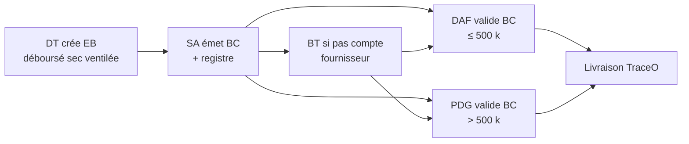
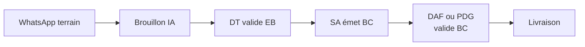

# Règles métier — Circuit achats & types d’EB

**Version :** 1.4 (août 2026 — collage EB ; rôles DT et SA/assistant peuvent valider)  
**Périmètre :** tenant pilote `co-btp-pilote`  
**Source :** entretien directeur technique — août 2026  
**Statut :** décisions D1–D4 validées DT — en attente validation DAF/SA/board pour mise en prod  

**Décisions validées :** [BTP-DECISIONS-DT-VALIDEES.md](./BTP-DECISIONS-DT-VALIDEES.md)

**Documents liés :**

- [BTP-REGLES-TOURNEES-BC.md](./BTP-REGLES-TOURNEES-BC.md) — BC → tournée, alertes livraison  
- [BTP-REGLES-STOCK-CHANTIER.md](./BTP-REGLES-STOCK-CHANTIER.md) — stock, seuils, journal quotidien  
- [BTP-WHATSAPP-DOSSIER-CHANTIER.md](./BTP-WHATSAPP-DOSSIER-CHANTIER.md) — capture WhatsApp terrain  
- [BTP-SPEC-F01-FICHE-CHANTIER-BUDGET.md](./BTP-SPEC-F01-FICHE-CHANTIER-BUDGET.md) — enveloppe CdG — **F01.1 développé hors prod**  
- [BTP-INDEX.md](./BTP-INDEX.md) — table des matières BTP (CDC : F01–F07, F09 ; hors F08, F10)  

---

## 1. Objectif

Formaliser les **deux familles d’expression de besoin (EB)** et le **circuit d’approbation** tel que pratiqué sur le terrain, en intégrant le retour du DT :

1. **EB déboursé sec** — au **lancement d’un chantier** ; émise par le **DT** (ventilée en lignes) ;
2. **EB courante** — besoin matériaux en cours de chantier ; issue du **terrain** (WhatsApp) puis **validation DT** ;
3. Suite commune après validation **métier** (DT) : **SA émet BC → validation DAF et/ou PDG → fournisseur / livraison** (voir documents liés).

> **Règles finance confirmées (août 2026) :**
> - Seuil **500 k FCFA** = **montant final du BC** (pas l’EB estimée).
> - Validation **DAF / PDG après émission BC** par le SA.
> - Cas **BT** (pas de compte fournisseur) : validation du **dossier BC + BT** + **preuve facture pro forma**.
> - **Envoi photo BC au fournisseur** (WhatsApp) : **uniquement après** validation DAF/PDG.

---

## 2. Glossaire rapide

| Terme | Définition |
|-------|------------|
| **EB** | Expression de besoin — demande d’achat chantier |
| **Déboursé sec** | Enveloppe / provision initiale pour démarrer un chantier (matériaux, petits achats, trésorerie chantier) — circuit **DT → SA → BC → DAF/PDG** |
| **EB courante** | Besoin récurrent ou ponctuel en phase d’exécution — souvent initiée par le technicien sur WhatsApp |

---

## 3. Types d’EB

| Type | Code système | Initiateur | Moment | Contenu typique |
|------|--------------|------------|--------|-----------------|
| **Déboursé sec** | `debourse_sec` | **DT** (manager) | **Lancement chantier** | Enveloppe globale **ventilée en lignes produits** par le DT (qté, unité, montant) — requis pour approbation DAF |
| **Courante terrain** | `standard` | Technicien → brouillon | **Exécution** | Besoin précis (qté, produit, urgence) |
| **Courante manager** | `standard` | DT / chef chantier | **Exécution** | Complément, urgence, ajustement |
| **Anticipation stock** | `stock_alert` | Système → brouillon | **Exécution** | Suggestion depuis seuil stock (DT valide) |

**Règle :** un chantier peut avoir **plusieurs EB** de types différents ; chaque EB suit le circuit d’approbation selon son type et son montant.

---

## 4. Circuit EB déboursé sec (lancement chantier)

### 4.1 Déclencheur

| Événement | Action |
|-----------|--------|
| Création / activation d’un **chantier** (`site`) | DT prépare l’EB déboursé sec |
| Chantier prêt à démarrer (date de démarrage validée) | DT **soumet** l’EB au **SA** (ventilation lignes obligatoire) |

**Hors scope pilote :** déboursé sec multi-chantiers regroupé ; ici **1 EB déboursé sec par chantier** au lancement (sauf décision board contraire).

### 4.2 Chaîne d’approbation



| Étape | Acteur | Statut TraceO cible | Action |
|-------|--------|---------------------|--------|
| 1 | **DT** | `submitted` → `sa_review` | Crée EB `debourse_sec`, **ventile le montant en lignes produits**, soumet au **SA** |
| 2 | **SA** | `sa_review` → `po_pending_finance` | Émet **BC** (montant **définitif**), ligne registre ; génère **BT** si pas de compte ; joint **facture pro forma** si BT |
| 3 | **DAF** | `daf_review` (sur BC) | Valide dossier **BC** (± **BT** + pro forma) si montant BC **≤ 500 000 FCFA** |
| 3b | **PDG** | `pdg_review` (sur BC) | Valide dossier **BC** (± **BT** + pro forma) si montant BC **> 500 000 FCFA** |
| 4 | **SA** | `po_ready` | **Envoie photo BC** au fournisseur (WhatsApp) — **après** validation finance |
| 5 | **TraceO** | `po_ready` → `delivery_scheduled` | Tournée auto si règles OK |
| 6 | **Livreur** | `delivered` / `partial` | Preuve + notification DT (§6) |

**Différence avec EB courante :** pas de brouillon WhatsApp ni étape « DT révision brouillon IA » — le **DT est l’auteur** et transmet directement au **SA** pour émission BC.

### 4.3 Champs obligatoires EB déboursé sec

> **Décision D1 (validée DT) :** enveloppe globale de démarrage, **ventilée obligatoirement en lignes produits par le DT** avant transmission au SA. Le contrôle financier (DAF/PDG) intervient **sur le BC émis**, pas sur un forfait EB seul.

| Champ | Obligatoire |
|-------|-------------|
| `site_id` | Oui |
| `eb_type` = `debourse_sec` | Oui |
| **Lignes produits** | **Oui** — min. 1 ligne : libellé, qté, unité, montant ligne (ou PU × qté) |
| `total_amount_fcfa` | **Oui** — doit être égal à la **somme des montants lignes** |
| `notes` | Recommandé — objet du déboursé (phase travaux couverte) |
| Fournisseur | Optionnel à l’EB ; requis au BC (SA) |

### 4.4 Contrôles avant transmission SA

| # | Contrôle | Si échec |
|---|----------|----------|
| C1 | ≥ 1 ligne avec libellé + qté > 0 + unité | Soumission **bloquée** |
| C2 | Chaque ligne a un montant renseigné | Soumission **bloquée** |
| C3 | `total_amount_fcfa` = Σ montants lignes | Soumission **bloquée** + message d’écart |

**Responsable ventilation :** le **DT** uniquement — pas le SA à l’étape BC.

### 4.6 Règles BT et PDG (confirmées finance — août 2026)

| Règle | Condition | Document / acteur |
|-------|-----------|-------------------|
| **Seuil validateur** | Montant **final du BC** émis par le SA | **Pas** le montant EB estimé par le DT |
| **BT** | FADYM **sans compte** chez le fournisseur (`suppliers.has_account = false`) | Fiche **trésorerie** à l’émission BC (SA) — achat espèces en présentiel |
| **Dossier BT** | BT requis | Validation finance sur **BC + BT** **+ facture pro forma** (pièce jointe obligatoire) |
| **PDG** | Montant **BC** **> 500 000 FCFA** | Validation **PDG** du dossier BC (± BT + pro forma) |
| **DAF seul** | Montant **BC** **≤ 500 000 FCFA** | Validation **DAF** du dossier BC (± BT + pro forma) |

**Matrice circuit après émission BC (SA) :**

```
                    ┌─ pas compte fournisseur → BT + facture pro forma jointe
                    │
BC émis par SA ─────┼─ montant BC > 500 k → validation PDG (dossier BC ± BT)
                    │
                    └─ montant BC ≤ 500 k → validation DAF (dossier BC ± BT)
                              │
                              └─ BC validé → SA envoie photo BC fournisseur (WhatsApp)
                                        └─ tournée / achat présentiel / livraison
```

**Champs / pièces obligatoires avant validation finance :**

| Pièce | Obligatoire si |
|-------|----------------|
| BC émis (PDF TraceO) | Toujours |
| BT (fiche trésorerie) | `has_account = false` |
| **Facture pro forma** (photo/PDF) | `has_account = false` |
| `supplier_id` sur EB/BC | Recommandé dès l’EB pour router BT |

**Interdit :** envoyer la photo BC au fournisseur **avant** validation DAF/PDG.

### 4.7 Documents SA générés

Mêmes exports que EB courante :

- Fiche **besoin achat** (EB)  
- Fiche **trésorerie** (BT) si **pas de compte** fournisseur  
- Ligne **registre BC** à l’émission  

---

## 5. Circuit EB courante (exécution chantier)

### 5.1 Chaîne (rappel)



| Étape | Acteur | Statut | Note |
|-------|--------|--------|------|
| Capture | Technicien | `draft_parsed` / `draft_review` | WhatsApp ; **collage** dans TraceO (DT, parfois SA/assistant) |
| Validation métier | **DT** ou **SA / assistant** | `submitted` → `sa_review` | Droit par **rôle** — voir §5.2 |
| Émission commande | **SA** | `sa_review` → `po_pending_finance` | BC montant **final** + registre ; BT + **pro forma** si pas de compte |
| Approbation financière | **DAF** ou **PDG** (selon montant **BC**) | `daf_review` / `pdg_review` → `po_ready` | Dossier BC ± BT ± pro forma — WA + capture si absent |
| Envoi fournisseur | **SA** | `po_ready` | **Photo BC** WhatsApp — **après** validation finance uniquement |
| Logistique | TraceO + livreur | `delivery_scheduled` → `delivered` | Tournée **après** BC validé — voir tournées BC |

**Point de convergence :** à partir de **`sa_review`**, le circuit est **identique** pour déboursé sec et courante (émission BC → validation DAF/PDG → livraison).

### 5.2 Collage du message WhatsApp dans TraceO (pilote A2 bureau)

Le besoin arrive en **texte** (copie depuis le groupe). TraceO parse les lignes ; un humain relit.

Pas de distinction **public / privé** sur le chantier. Les droits sont **par rôle** :

| Rôle | Coller | Corriger le brouillon | Valider / soumettre l’EB |
|------|--------|------------------------|--------------------------|
| **DT** | Oui | Oui | **Oui** |
| **SA / assistant** (`purchasing`) | Oui, **occasionnel** | Oui | **Oui** |
| DAF, PDG | Non (hors scope collage) | Non | Non |

Un même compte SA peut coller **et** valider dans la foulée. Le circuit **finance** ensuite est inchangé (émission BC → DAF/PDG).

Traçabilité : enregistrer **qui** a collé et **qui** a validé.

---

## 6. Informations livraison pour le DT (exigence retex)

Le DT souhaite être **informé des quantités livrées** sur un chantier, **partielles ou totales**, et **alerté en cas de livraison partielle**.

### 6.1 Déclencheurs notification DT

| Événement | Notification DT | Canal |
|-----------|-----------------|-------|
| Livraison **totale** (`delivered`) | Récap qté par ligne : commandé vs livré | App manager + WhatsApp optionnel |
| Livraison **partielle** (`partial`) | **Alerte prioritaire** — écart par ligne | App + WhatsApp + badge « action requise » |
| Livraison **refusée** | Alerte + motif | App + WhatsApp |
| Tournée **planifiée** (info) | BC référence, fournisseur, date | App (pas d’alerte critique) |

### 6.2 Contenu notification livraison

Pour chaque **ligne produit** du BC :

```
Produit     | Commandé | Livré  | Écart
------------|----------|--------|------
Ciment      | 50 sacs  | 50 sacs| —
Fer 12mm    | 20 barres| 15 barres | -5 ⚠
```

**Message type livraison partielle :**

> *« Livraison partielle — Chantier UBH — BC-2026-0042 — Fer 12 mm : 15/20 barres. Action DT : relance SA / complément ? »*

### 6.3 Actions DT après alerte partielle

| Action | TraceO |
|--------|--------|
| Acquitter l’alerte | Log dans journal chantier |
| Créer EB complément | Brouillon pré-rempli (qté manquante) → circuit courant |
| Escalade SA | Notification SA avec lien BC |

**Détail technique :** voir [BTP-REGLES-TOURNEES-BC.md § Alertes livraison](./BTP-REGLES-TOURNEES-BC.md).

---

## 7. Synthèse des souhaits DT (checklist produit)

| # | Souhait DT | Document / phase |
|---|------------|------------------|
| S1 | EB **déboursé sec** au lancement → SA → BC → DAF/PDG | Ce document §4 |
| S2 | Quantités livrées visibles par chantier (partiel / total) | §6 + tournées BC |
| S3 | **Alerte livraison partielle** | §6 + tournées BC |
| S4 | Technicien : **matin** tâches du jour ; **soir** travail réalisé + **matériel utilisé** → stock | [Stock § Journal quotidien](./BTP-REGLES-STOCK-CHANTIER.md) |
| S5 | **Alerte seuil** stock | [Stock §7](./BTP-REGLES-STOCK-CHANTIER.md) |

---

## 8. Modèle de données — extensions cibles

| Champ / entité | Usage |
|----------------|-------|
| `purchase_requests.eb_type` | `debourse_sec` \| `standard` \| `stock_alert` |
| `sites.launched_at` | Date démarrage — rappel EB déboursé sec si absent |
| `delivery_line_receipts` | Qté commandée / livrée / refusée par ligne |
| `purchase_requests.proforma_blob_id` | Facture pro forma (BT / pas de compte) — requis avant `daf_review` |

---

## 9. Phasage pilote

| Phase | Contenu |
|-------|---------|
| **A0** | EB courante WhatsApp → DT → SA → BC → DAF/PDG (aligner prototype : validation finance **post-BC**) |
| **A1** | Type `debourse_sec` + création DT → SA → BC → DAF/PDG |
| **A2** | Notifications livraison + alerte partielle |
| **A3** | Journal quotidien technicien + sorties stock |
| **A4** | Alertes seuil stock |

---

## 10. Décisions validées

| # | Sujet | Décision | Statut |
|---|-------|----------|--------|
| D1 | Déboursé sec | **Montant global ventilé en lignes produits** (DT) — requis avant SA | ✓ DT |
| D2 | Journal quotidien | **WhatsApp** (matin / soir) | ✓ DT |
| D3 | Alertes livraison | **WhatsApp + dashboard** | ✓ DT |
| D4 | Seuils stock | Définis par le **DT** | ✓ DT |
| F1 | Seuil 500 k | Sur **montant final BC** (pas EB) | ✓ Finance |
| F2 | Dossier BT | Validation **BC + BT + facture pro forma** | ✓ Finance |
| F3 | Envoi fournisseur | Photo BC **après** validation DAF/PDG | ✓ Finance |
| C1 | Collage + validation EB | Rôles **DT** et **SA / assistant** — pas de type chantier | ✓ Produit |

Détail : [BTP-DECISIONS-DT-VALIDEES.md](./BTP-DECISIONS-DT-VALIDEES.md)

### En attente board / DAF / SA

- [x] Circuit finance : validation **DAF/PDG après émission BC** (retex août 2026)
- [x] Seuil **500 k** sur **montant final BC** (confirmé finance)
- [x] Cas BT : dossier **BC + BT + facture pro forma** (confirmé finance)
- [x] Envoi photo BC fournisseur **après** validation DAF/PDG (confirmé finance)
- [ ] Valider le circuit **déboursé sec** DT → SA → BC → DAF/PDG au lancement chantier  
- [ ] Valider **1 déboursé sec par chantier** en pilote  

---

## 11. Écart prototype (août 2026)

Le code pilote (`procurementWorkflow.ts`) modélise encore une validation **DAF/PDG avant SA** (`daf_review` → `sa_review` → `po_ready`). La cible documentée est :

```
DT → SA émet BC → DAF ou PDG valide BC → po_ready → tournée
```

À aligner lors de la reprise dev post-board.

---

*Retex DT + finance intégrés — à valider avec DAF et SA avant implémentation.*
